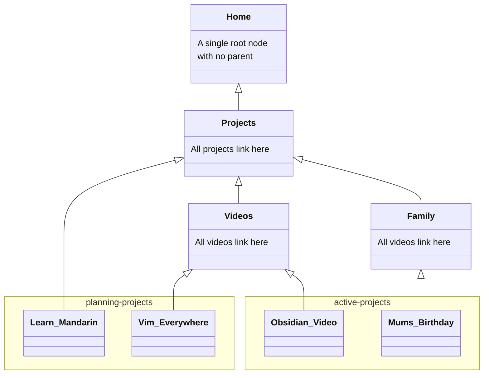

---
{"dg-publish":true,"permalink":"/1-projects/nb-43-building-your-second-brain-in-obsidian/","tags":["project/nb"],"noteIcon":"","created":"2025-01-08T16:29:58.943+00:00","updated":"2025-01-10T12:59:42.887+00:00"}
---

 

---

# ~~"Research"~~

# ~~Configuration~~

# ~~Procrastination~~

Like many of us, I suffer from a sickness.

I don't know what it's called, but left to my natural inclinations, I seem to spend all my time sharpening my metaphorical axes instead of using them.
Not only do I end the day without cutting down any trees, but if this continues, I will have ground my axes down to nothing.

---

> [!ERROR] Yak Shaving
> 1. Any apparently useless activity which, by allowing you to overcome intermediate difficulties, allows you to solve a larger problem.  &nbsp; &nbsp; &nbsp; &nbsp; &nbsp; &nbsp;&nbsp; **BUT ALSO**
> 2. The actually useless activity you do that appears important when you are consciously or unconsciously procrastinating about a larger problem.

I seems related to the problem, that in programming circles we call Yak Shaving.

Which is when you're doing:
1. An apparently useless set up task, OR
2. An ACTUALLY useless procrastination task
 
Preparing your tools is not the job, doing the job is the job.
And it's hard, sometimes, to tell which you're really working on.

---

# Tasks

# Projects

# PKM

> [!NOTE]
> This illness tends to effect even highly motivated and productive people:
> They know they have to be organised, so they use organisational apps, sites, and services to do so.

---

But new apps are being published all the time, and the existing ones release new features all the time to keep up with the pace of progress.
Not to mention when apps disappear or REMOVE features.

The result is this hedonic treadmill of:
- Leaping to a new app,
- moving some, but not all, of your data and tasks and projects to it,
- and then sooner or later being unsatisfied and leaping again.

Hoping each time that your next leap will be the leap home.
Or something like that.

---

calendar, tasks, research, *this video* - everything

I have finally solved this problem for myself with Obsidian.
And not because it happened to have all the features I want today, but because it allows me to trivially build all future features I may need tomorrow.

In this video (which is not sponsored by Obsidian), I'm going to show you how to build your custom-made second brain that fits your individual first brain perfectly by using Obsidian's core Triumvirate of features.

---

## Obsidian is a

# _Knowledge Platform_
## Not a Wiki

Obsidian isn't a personal wiki, it's a general purpose knowledge platform that allows you to build whatever systems you want,
the *default application of which* is a personal wiki.

You can build anything you want on top of the simple framework I'll teach you today:
- A todo system filtered by contexts, dates, priorities, and projects
- A writing environment for fiction or non-fiction, with queryable character timelines, references, or D&D monster stats,
- You can even build a youtube career on it if you're especially lucky.

All these uses, and more that you could imagine and then build yourself, can live in the same place, not in 10 different apps, on your own computer, phone, or tablet.

But unlike many other guides you may find, I'm also going to tell you what I wish people had told me when I got started: There are features of obsidian that you SHOULDN'T use.

And we'll start with the curse of FOLDERS.

> [!IMPORTANT]
> I'm still working on this video script, the rest is private until published.

 