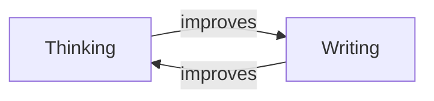

---
{"dg-publish":true,"permalink":"/1-projects/nb-43-building-your-second-brain-in-obsidian/","tags":["project/nb"],"noteIcon":"","created":"2025-01-08T16:29:58.943+00:00","updated":"2025-01-10T12:42:39.689+00:00"}
---


> A WIP video fusing advanced obsidian use


 

# ~~"Research"~~

# ~~Configuration~~

# ~~Procrastination~~


<div class="notes"> notes:

Like many of us, I suffer from a sickness.

I don't know what it's called, but left to my natural inclinations, I seem to spend all my time sharpening my metaphorical axes instead of using them.
Not only do I end the day without cutting down any trees, but if this continues, I will have ground my axes down to nothing.
</div>

---

> [!ERROR] Yak Shaving
> 1. Any apparently useless activity which, by allowing you to overcome intermediate difficulties, allows you to solve a larger problem.  &nbsp; &nbsp; &nbsp; &nbsp; &nbsp; &nbsp;&nbsp; **BUT ALSO**
> 2. The actually useless activity you do that appears important when you are consciously or unconsciously procrastinating about a larger problem.

notes:
I seems related to the problem, that in programming circles we call Yak Shaving.

Which is when you're doing:
1. An apparently useless set up task, OR
2. An ACTUALLY useless procrastination task
 
Preparing your tools is not the job, doing the job is the job.
And it's hard, sometimes, to tell which you're really working on.

---

# Tasks

# Projects

# PKM

notes:
This illness tends to effect even highly motivated and productive people:
They know they have to be organised, so they use organisational apps, sites, and services to do so.

---


notes:
But new apps are being published all the time, and the existing ones release new features all the time to keep up with the pace of progress.
Not to mention when apps disappear or REMOVE features.

The result is this hedonic treadmill of:
- Leaping to a new app,
- moving some, but not all, of your data and tasks and projects to it,
- and then sooner or later being unsatisfied and leaping again.

Hoping each time that your next leap will be the leap home.
Or something like that.

---


calendar, tasks, research, *this video* - everything

notes:

I have finally solved this problem for myself with Obsidian.
And not because it happened to have all the features I want today, but because it allows me to trivially build all future features I may need tomorrow.

In this video (which is not sponsored by Obsidian), I'm going to show you how to build your custom-made second brain that fits your individual first brain perfectly by using Obsidian's core Triumvirate of features.

---

## Obsidian is a

# _Knowledge Platform_
## Not a Wiki

notes:

Obsidian isn't a personal wiki, it's a general purpose knowledge platform that allows you to build whatever systems you want,
the default application of which is a personal wiki.

You can build anything you want on top of the simple framework I'll teach you today:
- A todo system filtered by contexts, dates, priorities, and projects
- A writing environment for fiction or non-fiction, with queryable character timelines, references, or D&D monster stats,
- You can even build a youtube career on it if you're especially lucky.

All these uses, and more that you could imagine and then build yourself, can live in the same place, not in 10 different apps, on your own computer, phone, or tablet.

But unlike many other guides you may find, I'm also going to tell you what I wish people had told me when I got started: There are features of obsidian that you SHOULDN'T use.

And we'll start with the curse of FOLDERS.

 

# Public Domain Videos

---

# The Obsidian Triumvirate

1.  ---
2.  ---
3.  ---

notes:

- The three primary organisational pillars inside obsidian, folders, tags, and links, all function to build hierarchies.
- They all function as some kind of organisation to naviage our second brain and find information and relationships quickly
- The primary difference between these three, is how rigid you need your hierarchy to be

---

# 📂

# Part 1

# [`/FOLDERS/`]()

---


 ---

notes:

 

- The core problem between folders and obsidian, is they do not play well with all other parts of the system that you will build
- they feel like a legacy feature that works very differently than all others:
    - I add tags or links inside my notes, interwoven with the content, but folders exist outside them, and CAN'T be tagged or linked to.
    - A file can only exist in a SINGLE folder, whereas I can link to many other files or use multiple tags.
HOWEVER,
- folders are not completely terrible.
- they work at the OS level, you can see them on a usb drive, sd card, or uploaded to a thirdparty service without having obsidian installed.
- That ain't nothing.
- But we're not filing customer records, we're building our second brain

Folders don't exist in our brains.
They are a physical limitation of paper.

And there is no paper here.

---

## Physical Metaphor

<split even>


&nbsp;
&nbsp;
&nbsp;


</split>

Left: Xerox Star, 1981. Right: Mac OSX, 2023

notes:

The physical metaphor of named folders that encapsulate files, was useful in the early days of computing as a system every office worker already found easy.

But is the easy choice always the right choice?

Folders contain no data for themselves, just a name, they can't represent text or images or anything, they can only act as a container for files that do.

---

 ---

# ⬇
 ---

notes:
The smoking gun that shows the compromise of folders is how we use them in web addresses.

What should be displayed when viewing the food folder, here?

On a computer, you'd see a list of files inside that folder, but on the web we want a page to be displayed to the user.
The convention, of course, is to display a file called index.html.

We crowbarred this convention into the web because we really need folders to represent some data.

*And they can't.*

And so they are not included in my Good Parts of Obsidian.
Tags offer a little more flexibility.

5:00

---

# Part 2

# [#Tags]()

---

## You Think You Know Tags?

 ---

notes:

- tags are good for categorisation,
- more flexible than folders, a note can be tagged by many tags.
- But it's more than that, in obsidian, there is the concept a of parent and child tags

---

 ---
- Just one good boy
<br/>
 ---
- A lot of good boys

notes:

In this example, searching for the whole tag only gets one dog, but searching for just animal/dog gets all dogs, no matter what breed or name they have.

In addition to placing tags in the body of your note, they can also go in the properties, which is an extremely exciting feature that deserves a detour to explain.

---

# 🦆

# Duck Typing

notes:

I don't use tags as much as other people do.
Tags are a last resort for me: I mostly don't care if a note is categorised as a duck, I care if it quacks like one.
Allow me to explain what I mean by that.

---

```yaml
__

start: 2023-07-10
due:   2023-08-21
__

# LT13.4
## Act 0
Hello world, Arctica isn't playing nice.
...
```


```sql
TABLE WHERE start <= date(today)
```

notes:

I don't need to tag this document as a project, I, Tris, know that any note that has a scheduled date and a due date IS a project.
So instead of redundnatly putting this note in a projects folder, or tagging it as a project, I just trust that any system I build, like this simple dataview query here,

If it quacks like a duck, it's a duck.

---

## Properties

```yaml
aliases:
  - howto
research:
  - "[[Internet - Wikipedia]]"
  - "[[International Space Station - NASA]]"
  - "[[Odysseus - Wikipedia]]"
category: "[[NoBoilerplate]]"
```

```markdown
This is an [[Article]] I'm drafting about the three very clearly related topics of the [[Internet - Wikipedia]], the [[International Space Station - NASA]] and the legendary figure [[Odysseus - Wikipedia]].

The power required to write this is over [power_rating:: 9000]
```

notes:

- tags go in the properties
- but the properties can contain any data
- Because it's not just a pretty table of metadata in the frontmatter of your notes
- using this you can treat your obsidian notes like a simple database, which is hugely powerful and core to the principle of building everything inside obsidian
- There are hundreds of plugins that let you visualise and manipulate your notes that support Properties, but the most exciting is Dataview.
- oh NO! we have to nest another detour INSIDE this detour - don't worry, I believe in us, we can do it!

---

# Dataview

```SQL
table from #dogs
```

notes:

- note

---

# Patreon Bonus: Vim Integration

- obsidian.nvim

---

```md

parent: "[[some category]]"
siblings:
 - "[[this guy]]"
 - "[[that girl]]"


# A Title
Go check out [[how to bake a cake]], it's [fun: 9000]

```


# 📑

# If I'm not _writing_

# I'm not _thinking_

 

notes:

- I think on the page, or virtual page.
- TODO: Explain my working memory challenges

---



---

> "Notes aren’t a record of my thinking process. They are my thinking process."

--Feynman

---

# 🔗

# Part 3

# \[\[LINKS]]]

notes:

 

- Links are the most flexible, powerful, and therefore complex, part of the system.
- But you must be cautious.

~4:00

---

## Simple Links

```markdown
This is an [[Video]] that I'm drafting,
about the three very clearly related topics of 
 
 
 
 

The power required to write this is 
over [power_rating:: 9000],
and I have [days:: 30] to complete it
```

notes:

- contrast
    - `[[wikilinks|name]]`, (don't work in gh markdown)
     
    - `[[absolute/wikiliks|name]]` (don't work in gh wiki),
    - `[friendly name](markdown/links)` (honestly, maybe this is the best option, when are wikilinks better than markdown links?)

---

## Backlinks

```markdown
# Coffee
Coffee is a beverage brewed from roasted coffee beans. Darkly colored, bitter, and slightly acidic, coffee has a stimulating effect on humans, primarily due to its caffeine content.

## Introduction to Europe
Thriving trade brought many goods, including coffee, from the Ottoman Empire to Venice. The first European coffee house opened in Venice in 1647.
```

```markdown
This is an [[Video]] that I'm drafting,
about the three very clearly related topics of 
 
```

notes:

- note

---

## Named Links

```md
What began with [cause:: [[3 Resources/Research/Readitlater/Coffee#Introduction To Europe\|Coffee#Introduction To Europe]]] led directly to [effect:: [[The French Revolution\|The French Revolution]]], and then, naturally, to [effect:: [[Wifi\|Wifi]]]
```

What began with [cause:: [[Coffee#Introduction To Europe]]] led directly to [effect:: [[The French Revolution]]], and then, naturally, to [effect:: [[Wifi]]]

notes:

- note

---

## PropertiesLinks

```yaml
research:
  - "[[Internet - Wikipedia]]"
  - "[[International Space Station - NASA]]"
  - "[[Odysseus - Wikipedia]]"
category: "[[NoBoilerplate]]"
```

```md
This is an [[Article]] I'm drafting about the three very clearly related topics of the [[Internet - Wikipedia]], the [[International Space Station - NASA]] and the legendary figure [[Odysseus - Wikipedia]].

Though the power required to write this is over [power_rating:: 9000], 
```

notes:

 

---

# Footnotes


[^1]: a footnote can these go anywhere?
[^2]: the second footnote

---

## Writing Tasks

 
 
 
 
 
 
 
 
 
 

# Publishing

## YT Video

 
 
 
 
 
 
 

```md
❤️ If you would like to support what I do, I have set up a patreon here: https://www.patreon.com/noboilerplate - Thank you!  
  
📄 All my videos are built in compile-checked markdown, transcript sourcecode available here https://github.com/0atman/noboilerplate this is also where you'll find links to everything mentioned.  
  
🖊️ Corrections are in the pinned ERRATA comment.  
  
🦀 Start your Rust journey here: https://www.youtube.com/watch?v=2hXNd6x9sZs  
  
👕 Bad shirts available here https://www.teepublic.com/user/no-boilerplate  
  
🙏🏻 CREDITS & PROMO  
My name is Tris Oaten and I produce fast, technical videos.  
Follow me here https://tech.lgbt/deck/@noboilerplate  
Website for the show: https://noboilerplate.org  
Come chat to me on my discord server: https://discord.gg/mCY2bBmDKZ  
  
If you like sci-fi, I also produce a hopepunk podcast narrated by a little AI, videos written in Rust! https://www.lostterminal.com  
If urban fantasy is more your thing, I also produce a podcast of wonderful modern folktales https://www.modemprometheus.com  
  
👏🏻 Special thanks to my patreon sponsors:  
- Jaycee,  
- Gregory Taylor,  
- Ything LLC  
And to all my patrons!
```

## Discord Post

```md
:tada: New video out!
# ---name---
:youtube: Video:
---youtube link---
```

## Masto Post

```
📣 New video out
"---name---"

#some, #good#, #tags
```

 
 
 

# META

## Code Block Fixes

```
<style>
:root {--r-code-font: "FiraCode Nerd Font";}
.reveal .hljs {min-height: 50%;}
</style>

## Mermaid Diagram Fixes
 
<style>
.reveal .mermaid svg {
  min-width: 100%;
  height: auto;
}
.reveal .mermaid svg .label-container {
  fill: var(--r-background-color) !important;
}
.reveal .mermaid svg .label foreignObject {
  overflow: visible !important;
}
.reveal .mermaid svg .nodeLabel {
  color: var(--r-main-color) !important;
}
.reveal .mermaid svg .edgePaths path {
  stroke: var(--r-main-color) !important;
}
.reveal .mermaid svg marker {
  stroke: var(--r-main-color) !important;
  fill: var(--r-main-color) !important;
}
.reveal .mermaid svg .edgeLabel {
  background-color: var(--r-background-color) !important;
  color: var(--r-main-color) !important;
  font-size: 13px;
}
</style>
```
