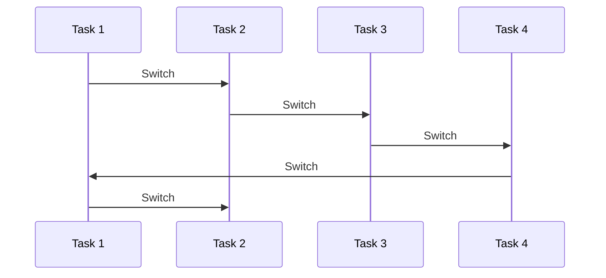
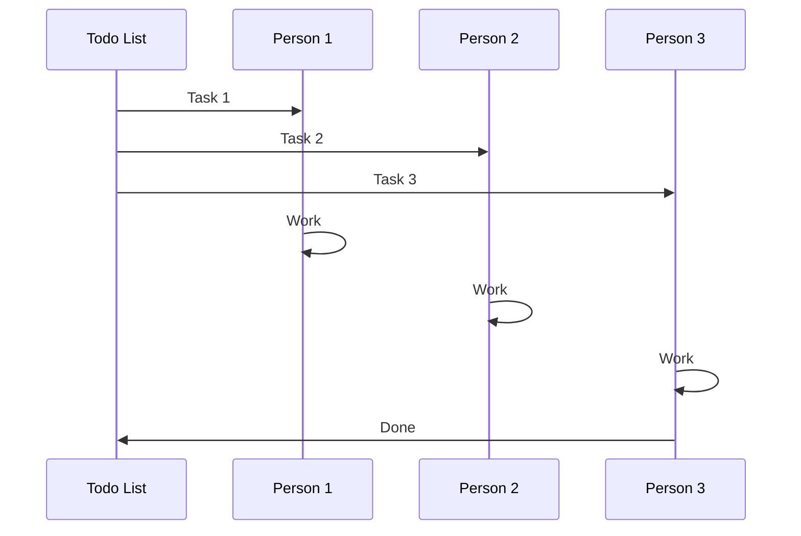
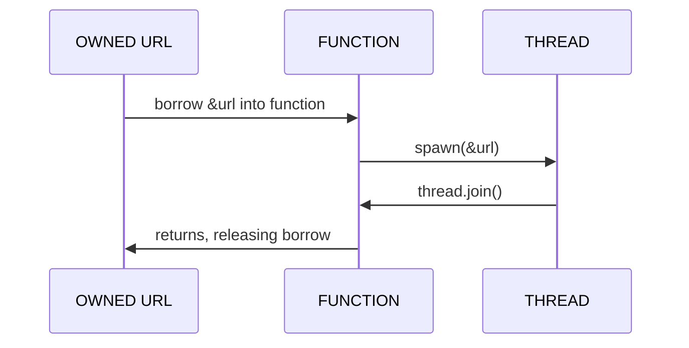

---
{"dg-publish":true,"permalink":"/async-isn-t-real-and-can-t-hurt-you/","tags":["project/nb"],"noteIcon":""}
---


Rust is the senior developer's dream language. Certainly, it is mine.

For the first time in my 15-year career, I feel that I have found a language that lets me confidently write not just high-level application code, but low-level driver code, and everything in-between, too.

What gives me this confidence is:
- rust's borrow checker,
- algebraic data types,
- powerful macros, and
- the unsafe system,
all kept sane by the friendliest compiler in the business.

I have explained the joy of rust at length on this channel, I shan't repeat myself here, see see my playlists if you're curious.

HOWEVER, some of what I have mentioned breaks down when interacting with async rust.


# 👻
# ASYNC RUST
# IS NOT EASY


> [!IMPORTANT] Steve Klabnik
> Just to be clear, async Rust is basically a miracle [^1]


Async code seems alien, some people even say it's not rust, it's a different language, hidden inside it, but the problem is simpler than that.

My core issue with async in Rust, isn't that it's bad, or broken or unusable - it's actually nothing short of miraculous - the problem is that it threatens what I consider rust's golden contract with its users:


# `RUST'S CONTRACT:`


## IF YOU USE REFERENCES

## THE COMPILER MAKES LIFE EASY


 ---


If you use references, the compiler will make your life easy.

You get Rust's superpowers for free if you use Rust's ownership model with its two kinds of references, shared and exclusive.


## HOW TO LEARN RUST:

## 1. Don't Use References
## 2. Copy & Clone Everything
## 3. Obey the Compiler


## &hellip;
## `4. DRAW THE REST OF THE OWL`


In my _How to Learn Rust_ video, I recommended that students:

> 1. Don't use references, use ownership and share nothing.
> 2. Copy and clone everything.
> 3. Only use references when the compiler tells you to.

I promised that following this would eventually teach you how to use most of rust properly.

But for async Rust, there is a part 4, which rather complicates maters.

Though the compiler is getting more and more helpful with each iteration, async is still a sharp edge, especially for newcomers.

Because it kindof forces you to learn everything.


## Public Domain Videos


> [!NOTE] &nbsp;Notes
> - For all links, read my scripts at www.namtao.com
> - All footnotes<sup>1</sup> are in the video description.


 

I dedicate my video scripts to the public domain.

Everything you see here: script, links, and images are part of a Markdown document available freely on github and my website, namtao.com.


# `PART 1:`
## WE WERE PROMISED
## FEARLESS CONCURRENCY


I'm going to discuss Concurrency and Parallelism today, and despite the assumptions of the `tokio` crate, these are very different techniques, and we should tighten up our definitions before we continue.


# CONCURRENCY




One thing at a time, most important thing first, start now.


 

You and I, as humans, are single-tasking creatures, we can do one piece of mental work at a time.
Concurrency is how we actually multitask, either by picking up one task at a time and working on it until we switch to another, or by rapidly switching between tasks, completing them all a bit slower.
This illusion causes people to think we are working on things in parallel, when in fact it's near impossible for us to do more than one task at a time.

A single CPU with a single thread multitasks with concurrency too, but because the CPU can switch tasks so incredibly fast, it really can feel like multiple things are progressing all at once, especially when many of the tasks are i/o bound, waiting for external inputs such as network or disk.
A single human only has access to concurrency.
Modern computers, of course, can also access Parallelism.


# PARALLELISM




Everything, everywhere, all at once.


Parallelism is simple to explain if rather complicated to get right.

For example, in a group project of 3 people, we each take a task and work on them in parallel until they are done.
And it's the same with parallel processing in computers.
The problem arises, just as in group work, when one person seems to never quite finish a task; a thread may never finish.
When we spawn it, and give it some work to do, we can't guarantee it will ever return the results of its computation.
Not a problem for laissez-faire 'fuck-it-ship-it' languages, but a REAL problem for Rust.
The compiler doesn't just want to know WHAT our data is, with its rich types, but WHEN our data is, by augmenting those types with lifetime annotations.
This is a critical pain point that we will come back to later.


## SHOW US THE CODE

```rust +validate:rust-script-pedantic
// cargo-deps: minreq = "2.13.4"
# #[allow(dead_code)]
fn expensive_fn(url: &String) {
  minreq::get(url);
  dbg!("What a nice url: {}", url);
}
```

NOTES:
- Not a single lifetime in sight
- I love the borrow checker
- Javascript wishes it looked this good
- What a day!
- What a lovely day!


OK, finally, some code.
Let's say we have an expensive function, perhaps it makes a network request, like here, that we want to run in the background while we do other things.

To do that, you might reasonably reach for Async, like in other languages.

Let's see what async looks like in Rust.
And now that `async-std` is deprecated, what that usually looks like is the tokio crate:


## ASYNC WITH TOKIO

````rust +validate:rust-script-pedantic +expect:failure
# //! ```cargo
# //! [dependencies]
//! minreq = "2.13.4"
//! http = "1.0"
//! tokio = { version = "1", features = ["full"] }
# //! ```
# fn main(){}
async fn async_expensive_fn(url: &String) {
  tokio::task::spawn_blocking(move || minreq::get(url)).await;
  dbg!("What a nice url: {}", url);
}
````


> [!CAUTION] CARGO BUILD ERROR:
> `url` must outlive `'static`&nbsp;
> &nbsp;


 

So here, we have rewritten our `expensive_fn()` into one that makes the get request asynchronously, we spawn it with the tokio executor and await the returned future.
Easy!

But oh, huh, this doesn't compile.


## TOKIO::TASK::SPAWN_BLOCKING

Our call to `spawn_blocking()`:

````rust {5} +validate:rust-script +expect:failure
# //! ```cargo
# //! [dependencies]
//! minreq = "2.13.4"
//! http = "1.0"
//! tokio = { version = "1", features = ["full"] }
# //! ```
# fn main(){}
async fn async_expensive_fn(url: &String) {
  tokio::task::spawn_blocking(move || minreq::get(url)).await;
  dbg!("What a nice url: {}", url);
}
````

`spawn_blocking`'s implementation[^2]:

````rust
pub fn spawn_blocking<F, R>(f: F) -> JoinHandle<R>
    where
        F: FnOnce() -> R + Send + 'static,
        R: Send + 'static,
````


Looking at the implementation, it seems that the `spawn_blocking()` function requires references to have the `static` lifetime, an annotation that ask the compiler to prove they will be valid for the entire execution of the program.
This is not the case for our `url` shared reference, the current lifetime is tied to the calling function's body, which in our example, immediately terminates!
OK, fair enough.
The full cargo error is very clear on how to solve this:


## TOKIO, FIXED

> Add explicit lifetime, change this line from `&String`

```rust +validate:rust-script
async fn async_expensive_fn(url: &String) {}
```

To `&'static String`:

````rust {4} +validate:rust-script
# //! ```cargo
# //! [dependencies]
//! minreq = "2.13.4"
//! http = "1.0"
//! tokio = { version = "1", features = ["full"] }
# //! ```
# fn main(){}
async fn async_expensive_fn(url: &'static String) {
  tokio::task::spawn_blocking(move || minreq::get(url)).await;
  dbg!("What a nice url: {}", url);
}
````


We simply obey the compiler, and dutifully add the static lifetime to the reference.
This syntax requires the compiler to prove that the `url` shared reference is valid for the entire execution of our program, not just for the duration of this single function.
The compiler is now happy, and if the compiler is happy, I... Hmm.
actually, I'm NOT happy, folks.
USUALLY when the compiler is happy I am happy, but today I am not.
Not at all.
In fact, I'm kind of FURIOUS.


It's not a story `tokio` would tell you...


OF COURSE, you can get fearless concurrency if you only send around static, read-only data, that's actually super unimpressive.
Forcing all our references to be valid for the lifetime of the program, effectively turns off a large part of the borrow checker.
I thought this was RUST!? No compromises, I want to have my cake and eat it too.
Don't worry, this story has a happy ending.


`letsgetrusty.com/start-with-tris`


I'm delighted to say that this video is sponsored by friend of the channel, Let's Get Rusty.  
In addition to being a Fellow Rust YouTuber, Bogdan runs Rust training both corporate and personal, with a new cohort starting next month.  
Visit letsgetrusty.com/start-with-tris, link in the pinned comment, to find out more about the training, and thanks so much to Let's Get Rusty for sponsoring this video!


# `PART 2:`

# FEARLESS
# PARALLELISM


The crux of the problem is that parallel async tasks, which tokio assumes we'll be using by default, can run for an unknowable amount of time as far as the rust compiler knows.
I told you we'd come back to this problem.

This means that all references must be valid forever, static.
This is fine for something like a server handling requests, but do I really need to throw out borrowing just because I want to make a get request?

No, and the good news is that this isn't some intrinsic property of Rust, for instance it's not like this using native os threads:


## `STD::THREAD::SPAWN`


```rust {3} +validate:rust-script +expect:failure
// cargo-deps: minreq = "2.13.4"
fn expensive_fn_noscope360(url: &String) {
  std::thread::spawn(|| minreq::get(url));
  dbg!("What a nice url: {}", url);
}
```


> [!CAUTION] CARGO BUILD ERROR:
>  `url` escapes the function body, must outlive `'static` &nbsp;
> &nbsp;


There we are - oh no!
The hydra just won't stay dead!
Stay strong, Hercules, I have just the weapon:


## `STD::THREAD::SCOPE`


```rust {3-6} +validate:rust-script
// cargo-deps: minreq = "2.13.4"
fn expensive_fn_scope(url: &String) {
  std::thread::scope(|s| {
    s.spawn(|| minreq::get(url));
  });
  dbg!("What a nice url: {}", url);
}
```


## ✨ MAGIC ✨


Marvellous!

Scopes are genius. All threads are `.join()`ed at the end of a scope, which blocks until they are all done.

This GUARANTEES to the rust compiler that all threads inside the scope will finish before it returns, which restores my favourite feature of rust, borrowing.

The `url` shared reference can be passed into a thread, and then, at some point in the future, can be released at the end of the scope.

My generalised advice to get fearless parallelism is to tightly scope it.


## Thread Ownership




Here's how it works:
- the function borrows a shared reference to the `url` variable
- then spawns a thread for processing it.
- at the end of the scope, all threads are joined,
- and finally, the shared reference is released

It doesn't look like this using async with tokio:


## Tokio Ownership

```mermaid
sequenceDiagram
    OWNED URL ->> FUNCTION: must borrow &url statically 
    FUNCTION ->> TOKIO EXECUTOR: spawn_blocking(&'static url)
    TOKIO EXECUTOR > TOKIO EXECUTOR: .await
    FUNCTION > OWNED URL: returns future 
```


We start off similarly, borrowing `url`, however, tokio requires all references to be static, so the static lifetime propagates up the call stack to wherever `url` was first borrowed, even if that was in synchronous code.
Then we spawn a task on the executor using `spawn_blocking`, and the work begins as we await the result of our future.

While both threads and tokio tasks are quite similar, the former feels like coding in Rust, whereas the latter feels like something else entirely.


## "I'LL USE ASYNC!"
 ---


Some people, when confronted with a programming problem, think "I know, I'll use async!", which of course means they now have two problems
Or perhaps two hundred if they use `tokio`.

One of my favourite things about Rust is that you can look at a function's code and reason about it without building an error-prone runtime in your head to simulate it on.
So much information is encoded into the type system, including the granular purity model of ownership, that you (and the compiler) can reason about your code in ways that other languages can only dream about.
(see my 'purity' video for details there)

Async processing requires a runtime, and if that runtime is the most common one - Tokio, this causes static references to infect huge parts of your code.

The issue with this 'static-everywhere' pattern is that it forces you to make guesses about your program's global runtime state, when before you could just reason about one function at a time, confident that the compiler is keeping the rest of your program in line.
This building up of your program's state in your own mind is not what we're here for, your brain won't scale.

BUT THE RUST COMMUNITY HAS YOUR BACK.


# PART 3:
# `SOLUTIONS`


Here are some examples of writing Async code in Rust, in ascending order of how much I like them:


# 4. `ARC`

````rust {7-9} +validate:rust-script
# //! ```cargo
# //! [dependencies]
//! minreq = "2.13.4"
//! http = "1.0"
//! tokio = { version = "1", features = ["full"] }
# //! ```
# fn main(){}
use std::sync::Arc;

async fn async_expensive_fn(url: String) {
  let url_arc = Arc::new(url.clone());
  let url_arc_clone = url_arc.clone();
  tokio::task::spawn_blocking(move || url_arc_clone);
  dbg!("What a nice url: {}", url);
}
````

Learn more:

> CTTM, "Rust's Alien Data Types 👽 Box, Rc, Arc"[^3]


I'm not interested in runtime borrow checking with arc, I'm interested in rust's zero cost native compile time borrow checking.

However, some problems simply require using arc and friends. Check out the linked CTTM video on alien data types for more details there.


# 3. `tokio-scoped`

````rust +validate:rust-script
# //! ```cargo
# //! [dependencies]
//! tokio = { version = "1", features = ["full"] }
//! tokio-scoped = "0.2.0"
# //! ```

#[tokio::main]
async fn main() {
    let mut v = String::from("Hello");
    tokio_scoped::scope(|scope| {
        // Use the scope to spawn the future.
        scope.spawn(async {
            v.push('!');
        });
    });
    // The scope won't exit until all spawned futures are complete.
    assert_eq!(v.as_str(), "Hello!");
}
````

Not bad!


This allows behaviour similar to the thread scope example - because all futures are guaranteed to have finished by the time the scope ends, references can be dropped after use.
However, this is not without drawbacks compared to a pure threaded example, a runtime is not free.
By definition, the more logic you push to runtime, the less the compiler can prove at compile time.
Lets keep going.


# 2. `SMOL`

````rust +validate:rust-script
# //! ```cargo
# //! [dependencies]
//! smol = "2.0.2"
# //! ```
use smol::{io, net, prelude::*, Unblock};

fn main() -> io::Result<()> {
    smol::block_on(async {
        let mut stream = net::TcpStream::connect("example.com:80").await?;
        let req = b"GET / HTTP/1.1\r\nHost: example.com\r\nConnection: close\r\n\r\n";
        stream.write_all(req).await?;

        let mut stdout = Unblock::new(std::io::stdout());
        io::copy(stream, &mut stdout).await?;
        Ok(())
    })
}
````


The `smol` crate is brilliant because it doesn't commit the original sin of conflating concurrency with parallelism. BOTH are available in smol, and you opt-in to what you want.

As the name suggests, it's also tiny! The entire executor is around [1000 lines of code](https://github.com/smol-rs/async-executor/blob/master/src/lib.rs).

You can even use tokio-based libraries with smol, by using the [`async-compat`](https://docs.rs/async-compat/latest/async_compat/) crate which adapts tokio futures and I/O types.


# 1. `RAYON`

````rust +validate:rust-script
# //! ```cargo
# //! [dependencies]
//! rayon = "1.10.0"
# //! ```
# fn main(){}
use rayon::prelude::*;

fn sum_of_squares(input: &[i32]) -> i32 {
    input.par_iter() // <-- just change that!
         .map(|&i| i * i)
         .sum()
}
````

> _Rayon: data parallelism in Rust_[^4]


If you just want to speed up an inner loop, in an otherwise synchronous program, don't infect it with async everywhere! Just use Rayon.

It magically converts any iterator into a parallel iterator (reminding me very much of Haskell's `par` keyword!).

Its data race free work-stealing parallelism has made it a rock star in the Rust world for a decade, read this article if you'd like to know how it works.


# 0. `Threads & Channels`

````rust +validate:rust-script
fn main() {
    use std::thread;
    let mut a = vec![1, 2, 3];
    let mut x = 0;
    thread::scope(|s| {
        s.spawn(|| {
            dbg!(&a); // We can borrow `a` here
        });
        s.spawn(|| {
            x += a[0] + a[2]; // We can mutably borrow `x`
        });
    });
    a.push(4); // we can modify and access our variables again
    assert_eq!(x, a.len());
}
````

Learn more in Chapter 16 of The Rust Book[^5]


But don't forget about the runtime that the operating system ALREADY gives us for free.
Modern Linux can manage tens of thousands of threads, which means you might not need to infect your code with async, even for a high-performance service!
Using native threads might also make your debugging easier:
Instead of tokio-specific instrumentation such as the excellent `tracing` crate, you can use any tools from the unix standard thread management ecosystem!


# ASYNC ISN'T REAL
# AND CANNOT HURT YOU


In short:

- Use plain, synchronous rust
- Use native `std::thread`s or `rayon` for parallelism
- Use `smol` for fearless concurrency
- If you're building a service, `tokio`'s fine!

> Bonus: For advanced use, try the `futures` crate!


In Rust, you don't HAVE to use async, and if you do, you have more options than tokio.
The core of my advice is that if you scope the async part of your code tighter than 'the whole program', your life will be better.

You can keep writing Rust, with the compiler as your trusted guide because async isn't real, and cannot hurt you.


# PODCAST ANNOUNCEMENT


`DECAPSULATE.COM`

Thanks to all my NB patrons:

```rust
let sponsors = [
	"Jaycee", "Ything LLC", "PotatoScream"
];
let patrons: [&str; 899];
```


The rumours are true, after producing fiction podcasts for 5 years, I'm finally releasing my first talking-heads style podcast. On it, my friend Robin and I decapsulate many of the topics I talk about, here on my channel.

I've posted episode 1 right here in the No Boilerplate feed, click this video or the link in the description, and episode 2 is out early for patrons now, too.

Listen at decapsulate.com or wherever you get your podcasts. If you don't have a podcatcher yet, I use the _Pocket Casts_ app and love it. They're not even sponsoring me... YET!

Thank you so much for watching and listening, talk to you on Discord.


Footnotes
===

[^1]: https://www.youtube.com/watch?v=1zOd52_tUWg
[^2]: https://docs.rs/tokio
[^3]: https://www.youtube.com/watch?v=CTTiaOo4cbY
[^4]: https://smallcultfollowing.com/babysteps/blog/2015/12/18/rayon-data-parallelism-in-rust/
[^5]: https://doc.rust-lang.org/book/ch16-01-threads.html

 