---
{"dg-publish":true,"dg-path":"relationship-anarchy","permalink":"/relationship-anarchy/","tags":["project/nb"],"noteIcon":"","updated":"2026-05-23T15:06:16.795+01:00","dg-note-properties":{"start":"2026-05-09","due":"2026-05-15","up":["[[No Boilerplate Index]]"],"tags":["project/nb"],"state":"writing"}}
---

    Hi friends my name is Tris and this is No Boilerplate, where I focus on fast, technical videos.

---

# `RELATIONSHIP ANARCHY`

    A lesson that I suspect many parents and teachers are already hoping to instil in the young people in their care is: No one is ALWAYS more important than anyone else, and no relationship is ALWAYS more important than any other.
    This received wisdom comes in many forms, "don't forget your mates when you get a girlfriend" would be an example, but so would "Don't let your parents dictate whom you choose to marry".
    These might seem like common sense, but society actually has VERY specific ideas about which relationships are more important than others.
    And as anyone who has learned chemistry after high school will tell you, sometimes you have to unlearn everything you had been taught for your entire life to improve.
    Relationship Anarchy provides an alternative lens for us here, but first we must ask ourselves, do we know what anarchy is?

---

## PUBLIC DOMAIN VIDEOS

> [!NOTE] &nbsp;Notes
> - For all `links`, read my scripts at www.namtao.com
> - All footnotes0 are in the video description.

I dedicate my video scripts to the public domain.

Everything you see here: script, links, and images are part of a Markdown document available freely on my website, namtao.com, and github.

---

# `WARNING: POLITICS`

(boo!)

    I have a deal for you:
    You forgive me for sneaking politics into my video, and
    I promise to speed through the political theory SO FAST
    that it'll, most likely, be factually wrong.
    Deal?
    OK HERE WE GO

---

## `WHAT IS ANARCHY?`

Abolish:
- authority
- coercion
- hierarchy

in our _political process_

    > Political Anarchism is a philosophy and movement that seeks to abolish authority, coercion, and hierarchy in our political process.
    
    Political anarchy questions inherent hierarchies in society:
    - kings and subjects
    - lords and serfs
    - bosses / eployees
    - rich / poor
    
    Asking especially why having some people in power over other people is so highly valued in our society.

---
## `WHAT IS RELATIONSHIP ANARCHY?`

Abolish:
- authority
- coercion
- hierarchy

in our _interpersonal relationships_

    > Relationship Anarchism is a philosophy that seeks to abolish authority, coercion, and hierarchy in interpersonal relationships.
    
    Relationship Anarchy questions inherent hierarchies in our relationships, especially why romantic relationships are so highly valued in our society over all other kinds.

---

"NO GODS, NO MASTERS"

"OH GOD, YES MASTER"

    Anarchy rejects hierarchy in our political process, _relationship_ anarchy rejects hierarchy in our relationships with each other.
    Are we clear? An-archy; Against heirarchy.
    Thank you for your patience, boring time over.

---

FULL DISCLOSURE:
## `I'M A STRAIGHT WHITE CIS MAN`
## `IN A HETEROSEXUAL MARRIAGE`

_(ie "easy mode")_

    Full disclosure: I wrote this video to introduce you to this important, yet inherently queer topic.
    Please understand that I'm not speaking from experience, but a hyperfocused sidequest deep-dive I went down while researching mental health topics for my podcast, Lost Terminal!
    I have provided links to books, articles, and other vides by queer experts in the field for you to engage with further, and I recommend you do.

---

# `AMATONORMATIVITY`
(the societal assumption that everyone prospers with one exclusive romantic relationship[^1])

    As we move through our lives, we are surrounded by bad relationship examples, in books, films, online, and even in our parents and teachers.
    I don't blame them, they're just doing the best they can, following society's default path that Relationship Anarchists name "The Relationship Escalator":

---
Tool #1:
## `THE RELATIONSHIP ESCALATOR`

`Image credit: Nick Roberts, The Washington Post`

    This is the first tool I want to tell you about today
    Society seems to have this rule that EVERY romantic relationship MUST follow this exact route:
    - Meet
    - Date
    - Exclusive
    - Move in together
    - Get married
    - Share finances
    - Have/adopt children
    - Retire
    - Die
    It's called an "Escalator" because once you're on the bottom step, you are pulled UP by society, even if you're very comfortable where you are, thank you very much. Or perhaps you'd like to slow down, or return to a previous, comfortable, level, without breaking up and starting all over again, at the bottom.
    
    This metophor is genius, because if you ever try to walk down an 'up' escalator, you don't just have to fight against the will of the machine, but all the people who protest as you push past them, who are saying things like:

---

_"He's not asked you to marry him yet? What a time-waster!"_

`well-meaning friends`

    _"He's not asked you to marry him yet? What a time-waster!"_

---

_"You guys aren't exclusive? You're obviously not serious about each other."_

`less-well-meaning friends`

    _"You guys aren't exclusive? You're obviously not serious about each other."_

---

_"You've been married for 5 years, WHERE ARE MY GRANDCHILDREN?"_

`well-meaning parents`

    _"You've been married for 5 years, WHERE ARE MY GRANDCHILDREN?"_

---

_"I go on too many dates_

_but I can't make them stay._

_(at least that's what people _say_...)"_

`T. SWIFT, WARRIOR-POET`

    AND EVEN: "I go on too many dates, but I can't make them stay. At least that's what people say." TAYLOR, darling, who are these "people"? Blink twice if you're under duress.

---

*\[Two little lovebirds\] sitting in a tree*

*K-I-S-S-I-N-G!*

*First comes love*

*Then comes marriage*

*Then comes baby in a baby carriage!*

`Traditional nursery rhyme`

    - And they start US so young!
        - FIRST comes love
        - THEN comes marriage
        - THEN AND ONLY THEN ARE BABIES AUTHORISED
    - and so on, in every film, every song, every hallmark advert. Death by a thousand paper cuts, and we hardly even know we are learning these rules

---

## PATREON.COM/NOBOILERPLATE

- 📼 Early, longer, and more detailed videos
- 👨‍🏫 1:1 Mentoring over video chat. Email: mentoring@namtao.com
- ❤️ My infinite gratitude for allowing me to continue making these videos

It's just me running this channel, and I'm so grateful to everyone for supporting me on this wild adventure. Please consider my Patreon, especially if you'd like more videos like this, as queer topics are often demonetised here on YouTube.

If you'd like to see and give feedback on my videos up to a week early, as well as get private discord access, and even your name in the credits, it would be very kind of you to check my Patreon.

I also offer regular mentoring. If you'd like 1:1 tuition on ADHD & autism, personal organisation, programming, creative production, or anything that I talk about in my videos, do sign up and let's chat!

---

## `SOME BAD RELATIONSHIPS`
# `IN STORIES`

    Let's look at some case studies, shall we?

---

(& JACOB)

# BELLA & EDWARD

    AUDIBLE GASP! Bella can't possibly have complex feelings for TWO guys, that's UNHEARD OF! WHAT CAN SHE, A GOOD MORMON-CODED GIRL, DO?

---

(and whats-his-name, the evil prince guy)

# ANA & KRISTOF

    Poor stupid kristof knew that society would judge Ana's possible future relationship with her possible future price husband as more important than his, a mere peasant's, love

---

Baz Luhrmann's "Romeo ☩ Juliet" (1996) is THE BEST ADAPTATION FIGHT ME

# ROMEO & JULIET

    These two star-crossed galazy brain geniuses don't even know each other's NAMES until act 2!

---

(the set designer and director disagreed about how many candles are in this scene)

    The point is, society had a LOT to say about Romeo & Juliet's relationship, but none of it actually helped them.
    The lesson is clear: WE MUST TALK TO THE PEOPLE WE ARE IN RELATIONSHIPS WITH, not just make assumptions.

---

# `TRADITIONAL COUPLING`
# `CAN BE HARMFUL?`

    traditional coupling can be harmful
    
    When we're in love with someone, especially at the start, the romance can feel all-encompassing: This special someone seems to be all we're talking about and thinking about, isn't it good to pour all of our effort and expectations into this person?
    Just as we have heard people do in every story ever written?
    
    It's not, and I'll explain using tool #2:

---

TOOL #2:
## `THE SMORGASBORD`

    In a restaurant, a smorgasboard is a buffet of many small items that you can fill you plate with.
    A little of this, a little of that. If you don't like meat, no-one is forcing you to have some, if you love olives, take a whole bunch!
    It's an alternative to a set menu, where you'll eat what you are served, like it or not.
    Relationship Anarchists take all the behaviours that, according to the escalator, previously had to be fulfilled by just one person, and splits them into a buffet that you can use as a conversation starter with your friends, paramours, or messy situationships.

---

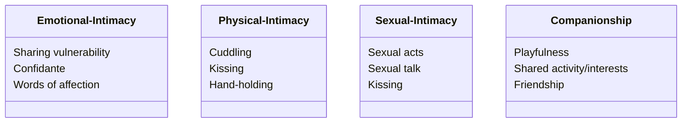

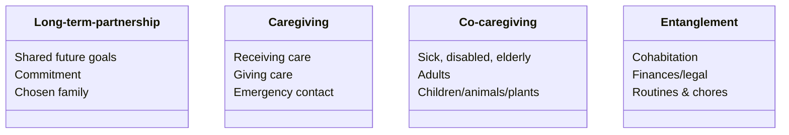

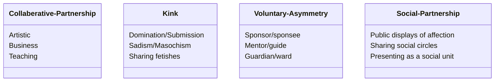

AN EXAMPLE RELATIONSHIP ANARCHY SMORGASBORD

---

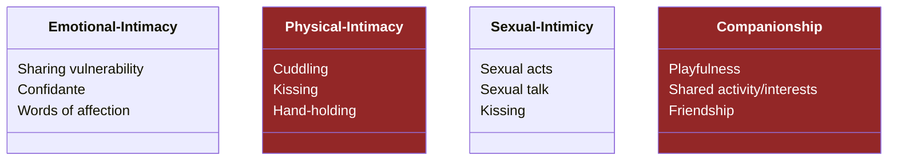

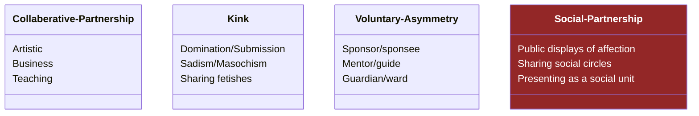

ALICE & BOB

---

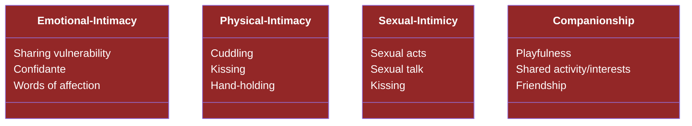

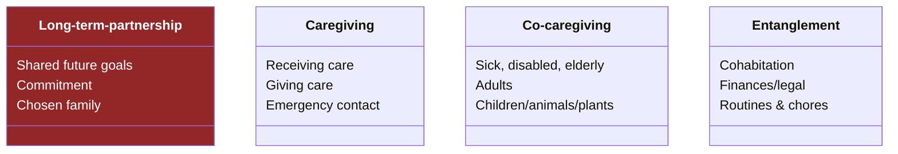

ALICE & JANE

---

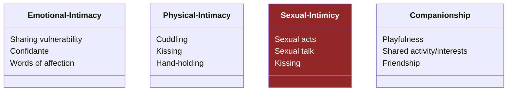

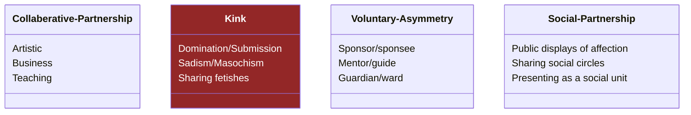

AN EXAMPLE RELATIONSHIP ANARCHY SMORGASBORD

    Just look at the options that are available! Quite a menu.
    Most people won't have an appetite for everything here, and that's fine, that's how a menu WORKS!
    (some people don't like food that's too spicy and that's the same here! I am not here to kinkshame!)
    
    Having all these topics available to discuss with someone you are in a relationship with, gives you a much richer vocabulary to answer the question "so what are we to each other".
    Far more than friend/lover/partner, the only options society tells us are avilable.
    
    For example, Alice and Jane might like sleeping together, but after discussion, don't see themselves moving in or starting a family or caregiving for each other.
    Alice and Bob see each other all the time, and they are comfortable with cuddling while watching a movie and holding hands while in social situations, and love their relationship just as it is.
    Any of these people might have other relationships that involve other parts of the smorgasboard, and just as you don't check with existing friends before making a new friend - you just do it! RA is optimised for the lovely unexpected.

    This all sounds utopic, but there is a darker side of the Smorgasboard, which I touched on earlier:
    
    Under the existing assumptions of the kind of society that unquestioningly accepts the Relationship Escalator, ALL THESE OPTIONS must be fulfilled by EXACTLY ONE person.
    
    What a terrible burden to put on someone, right?

---

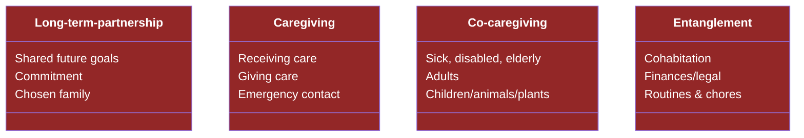

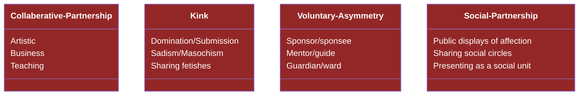

THIS IS TOO MUCH

---

## `OPTIMISING FRIENDSHIPS`

Quote from: thethinkingasexual.wordpress.com[^2]

    RA IS ABOUT OPTIMISING FRIENDSHIPS
    There's no escalator for friendships because society, in general doesn't place importance on them.
    Sex sells but friendships don't.
    Isn't that sad?
    acexual and aromantic people suffer hugely from this depriotisation of friendships - take away friends and what is left?

    As The Thinking Aro says:

    "relationship anarchy is fundamentally about community, as much as monogamous and polyamorous lifestyles are fundamentally about the couple.
    That doesn’t mean couples can’t exist in relationship anarchy, but it does mean that the focus of a relationship anarchist’s life and emotional energy is not a couple relationship by default, the way it is for monogamists and polyamorists."

---

## `PROJECT HAIL MARY`

_"You have no family. You don't even have a dog."_

    A clear example of society devaluaing friendship relationships is Project Hail Mary, my film of the year so far:
    Because grace has no family, he is expendable, because family are assumed to be more important than him enriching the lives of hundreds of his students

---

# `REALITY CHECK`

    I want to pause at the end here and give a reality check.

    It's very normal to place more importance on those we love, families especially.
    And because of this, society is rather set up for the two-person double-income household, so much so that having a roommate when renting a flat is assumed behaviour.
    Coupling, in one way or another is often the easier choice for people.
    RA encompasses these coupled relationships, too, but doesn't accept them as the default or best, and neither should you.

---

# `DON'T GUESS: TALK`

1. Love is abundant, and every relationship is unique
2. Love and respect instead of entitlement
3. Find your core set of relationship values
4. Heterosexism is rampant and out there, but don’t let fear lead you
5. `Build for the lovely unexpected`
6. Fake it til' you make it
7. Trust is better
8. Change through communication
9. Customise your commitments

From *"The short instructional manifesto for relationship anarchy"*, Andie Nordgren

    Assumptions are never good, and that counts double in relationships, especially the harmful assumption that your exclusive partner must fulfil everything you require - how could that POSSIBLY be?
    
    Would you want the pressure of fulfilling everything on the smorgasbord for your partner?
    And what about the quiet resentment when you inevitably fall short.
    
    RA provides an ethos and framework to talk to the people you are in relationships with without the baggage of society dragging you down.

    instead of having romantic partners and friends you just have relationships - defining what each means within them.

    You might one day get married, I can highly recommend it!
    But if you do so on the strong foundation of communication that RA requires, you will be happier, and your partner will be too.
    - And her partner
    - And his thruple
    - and all friends who you loved along the way.

---

## FANCY A PODCAST?
_I'm producing the following RIGHT NOW:_

`LOST TERMINAL`
- Near-future Sci-fi
- Hopepunk / Solarpunk
- _Extremely British_

`MODEM PROMETHEUS`
- Contemporary Urban Fantasy
- Technology blended with magic
- _Extremely British_

`PHOSPHENE CATALOGUE`
- 1976 Urban Fantasy
- Magical artwork
- _Extremely British_

`DECAPSULATE`

- Non-fiction(!)
- Discussion
- Robin & I unpack NB's technical topics
- _Extremely British_

---

If you would like to support my channel, get early ad-free and tracking-free videos, your name in the credits or 1:1 mentoring, head to my patreon or ko-fi.

If you're interested in transhumanism and hopepunk, please check out my weekly sci-fi audiofiction podcast, Lost Terminal.

If you like urban fantasy, I produce a wonderful podcast called Modem Prometheus.
I just finished Season 3 of The Phosphene Catalogue, if you like mysteries and art, check it out!

Transcripts and compile-checked markdown sourcecode are available on namtao.com and github, links in the description, and corrections are in the pinned ERRATA comment.

Thank you so much for watching, talk to you on Discord.

---
 