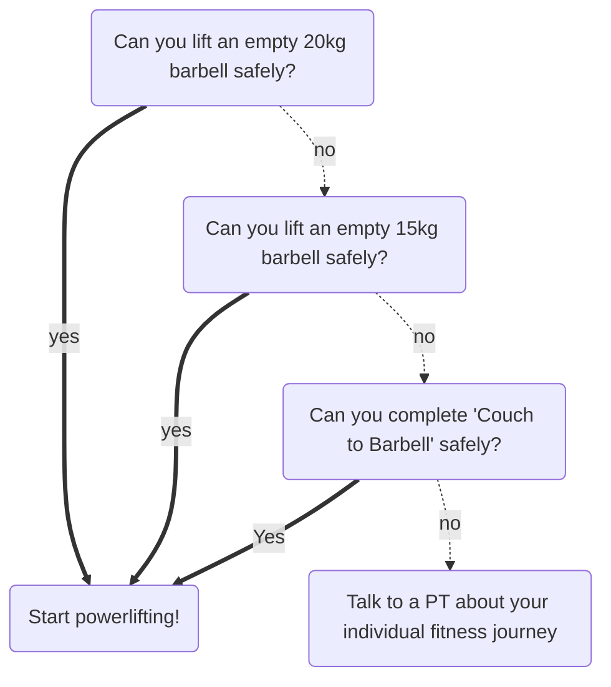
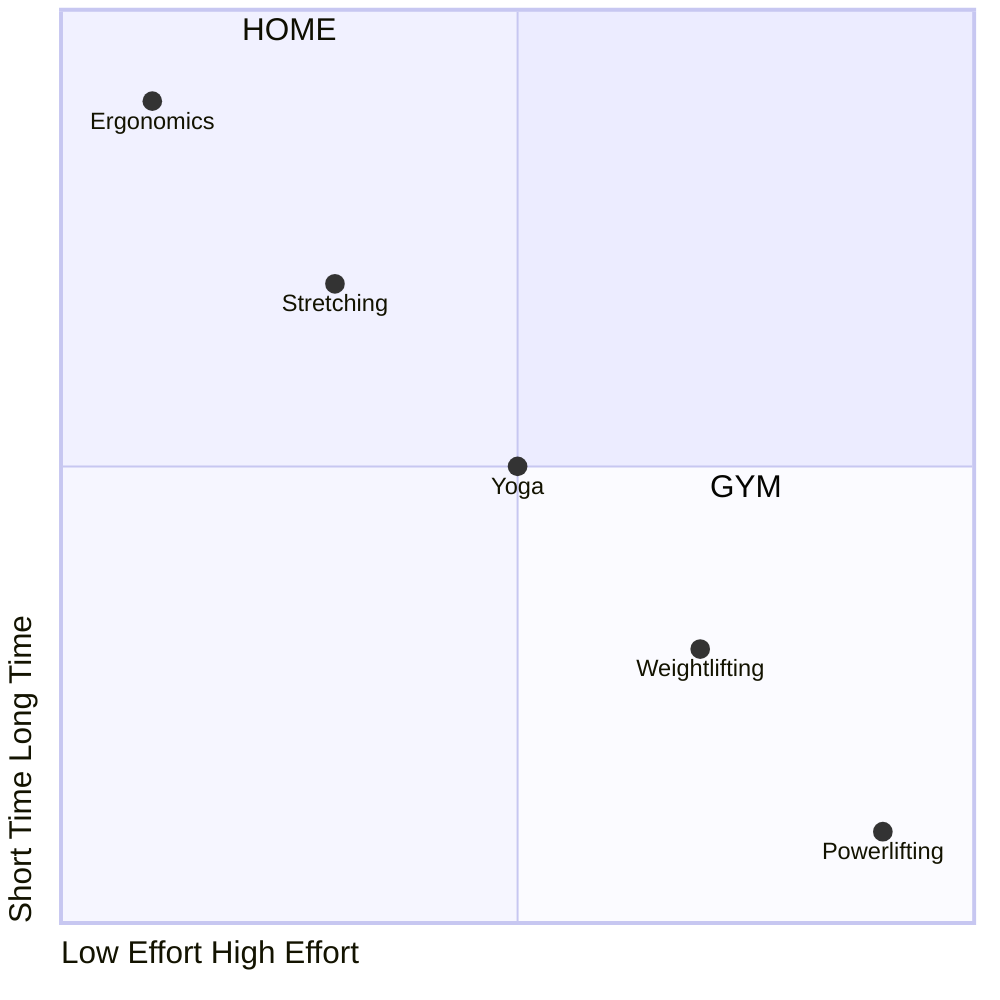

---
{"dg-publish":true,"permalink":"/hack-your-brain-with-powerlifting/","hide":true,"tags":["project/nb"],"noteIcon":""}
---


<div style="position: relative; padding-top: 56.25%;"><iframe title="Hack your Brain with Powerlifting" width="100%" height="100%" src="https://makertube.net/videos/embed/i1ic9eu7MJrW4NgpUv1kLX?warningTitle=0" style="border: 0px; position: absolute; inset: 0px;" allow="fullscreen" sandbox="allow-same-origin allow-scripts allow-popups allow-forms"></iframe></div>


_Our bodies are not even CLOSE to adapting to **AGRICULTURE**, let alone desks and computers._


Hi friends my name is Tris and this is No Boilerplate, where I focus on fast, technical videos.

I talk a lot about hacking your brain on this channel:
Lifehacks to increase your productivity or happiness, polyphasic sleep to get more time out of your days, and a LOT on how to organise your life with plain text digital tools.

However, there is an elephant in the room.

Everything I just described requires you to interact with the world, either through a pen, or keyboard, or some systems that, often enough, require you to sit at a desk for long periods of time pressing buttons.

And just this simple, gentle action, if repeated for years, can injure us, and then we can't type or write or sit as comfortably as we used to, and all our brain hacks will be for nothing.

SO: To hack your brain effectively, you must ALSO hack your body.


# PART 0
## DISCLAIMER


_Gender, body type, background, and age do not matter_

_...though for reasons of my liability, please be over 18 and in good, medical-professional-certified health_


`Paraphrased from the introduction of "Couch To Barbell", by Casey Johnston`


## WHEN TO USE A BARBELL




One of the revelations when I first began looking into powerlifting in 2020, was how few exercises were trained, 3 core movements, and how little Equipment was required to train them, a barbell.

What the hell was all the other junk at a gym for, I thought?
The answer is simply for specialisation. In powerlifting, you may need complementary training with free weights or machines, but you don't at the start.

The advice in the sources I have read is to try out the Barbell first.
Barbell training requires that you be able to move around in certain ways while under the bar, if that is not possible for you due to disability, injury, or other complications, then you may find a machine better suited, and you may ignore this advice.
A Deadlift using a Smith Machine is easier and safer because it greatly reduces the variables so you can't get them wrong. However, you don't want that, because a large part of our training is LEARNING HOW TO MOVE correctly.
- If you can't lift the empty bar, which weights 20KG by itself, don't worry many gyms have lighter bars to get you started! if it's still too much, then Casey Johnston has your back with her course Couch To Barbell, which takes you from lifting a broomhandle to lifting the bar.
- 


# A TALE OF TWO BOOKS


_"What Starting Strength lacked in polish or flash it made up for with raw, unflinching, unsparing density"_


`Casey Johnston`


_"Physical strength is the most important thing in life."_


`Mark Rippetoe`


My two primary sources are Casey Johnston's primer on how Powerlifting changed the last decade of her life, and the textbook she recommends, Starting Strength, by Mark Rippetoe, now in its 3rd edition.

NONE of this is sponsored, probably they would want to distance themselves from this amateur telling you how to do with powerlifting...


# PART 1
## PREVENTION > CURE


_(with apologies to Robert Smith)_


For all my adult life, I have suffered from posture-related back problems.
"Nerd Back" I believe is the technical term.
I don't dare estimate how much money I have spent on physiotherapists over the years, but I imagine it could have paid for quite a nice car by this point.

No-one told me that programming is DANGEROUS.

I'm serious: Footballers and gymnasts and track runners - all these people have well-understood training programmes to help support their dangerous professions, but no-one tells programmers to lift weights.

Lift with your legs not your back is the standard recommendation.
This is good advice if you are like most of us, and sitting at a desk for much of our days has given us a weak back. BUT DO YOU SEE THE PROBLEM HERE.
Wouldn't it be better to NOT HAVE A WEAK BACK?


## ERGONOMICS ARE NOT ENOUGH


The thing most people talk about in programming circles, certainly the ones I've been in for 15 years, is ERGONOMICS:
- Get a gaming chair with back support
- Take typing breaks every 20 minutes
- Use a MECHANICAL keyboard
- Use a vertical mouse
- Make sure your monitor is at the right height
- Use an ERGONOMIC MECHANICAL keyboard
- Use a pen tablet
- Use a SPLIT ERGONOMIC MECHANICAL keyboard
- Use a chair with adjustable tilt
- Get a standing desk
- Don't forget foot support!

I have tried all of these.

None of them worked for me in the long run.
They all seemed to in the short term, but soon enough I began to get aches and pains again.
I now realise that the ACT of changing my desk environment was perhaps what was working, not any SPECIFIC change I had made.
"The best position is your NEXT position" as Physiotherapists often say.


## GYM MEMBERSHIP > DOCTOR


_"Exercise is not a thing we do to fix a problem – it is a thing we must do anyway, a thing without which there will always be problems."_


`Mark Rippetoe, "Starting Strength", 3rd Edition`[^1]


A gym membership is Cheaper Than A Doctor
Going full-time here on YouTube has been wonderful for many reasons:

However, in granting my wish to be able to spend all my time writing, the cursed monkey's paw has caused me one big problem, one that is obvious in hindsight: RSI.

At the start of 2023 I lost the war with RSI that I had unknowingly been waging my entire life: The pains in my fingers, wrists, forearms, and elbows no longer went away when I took breaks or adjusted my ergonomics, even after multiple weeks without touching a keyboard.

This was miserable, and, frankly, existentially catastrophic to my sense of self, not to mention my income.
Not only did all of my work live inside my computer, all of my friends did, too.

After months of weekly appointments with specialists, and doing all the little stretches and movements they prescribe you, I had had enough.
"I will do ANYTHING to cure this," I told my favourite Physiotherapist, eventually, "give me HARD exercises to do, I'll get a gym membership, I'll go swimming 3 times a week - ANYTHING!"
"Tris," he said, "that is music to my ears".


## STRENGTH IS BETTER THAN ERGONOMICS


_"Exercise is the thing we must do to replicate the conditions under which our physiology was – and still is – adapted, the conditions under which we are physically normal."_


`Mark Rippetoe, "Starting Strength", 3rd Edition`[^1]


Various Physios have told me that they are often confounded by the problem that people don't WANT to exercise, they, very reasonably, WANT to live their lives.
Physios know that they can't reasonably ask most of their patients to do the one thing that would surely cure them: Go to the gym regularly and work on the specific problem until they are strong enough to never relapse,
Instead, they give little exercises, do these 10 stretches twice a day, etc, that provide JUST ENOUGH relief to get the patent back to work.

THIS WAS NOT ACCEPTABLE TO ME.


# PART 2

## WHY POWERLIFTING?


_"Never half-ass two things, whole-ass one thing"_


`Ronald Ulysses Swanson, philosopher & jazz virtuoso`


It's because I'm impatient short on time.
At the start of the training, where most of the benefits I'm interested in happen, powerlifting represents the absolute least amount of time I need to be away from my computer, in order to continue using it indefinitely.


## EFFORT VS TIME




It's counter-intuitive, but you have to get out of your house


Look, I made a graph:

- Ergonomics, at the top-left, can be thought of as tiny, constant changes, the doesn't take any effort, but it requires near-constant practice
    - I don't want that
- Stretching, like a physiotherapist or doctor might prescribe is more strenuous, but to get relief from RSI, you'll be doing them multiple times a day
    - I don't want that
- Yoga, which I'm a big fan of, mostly requires no equipment, if you have a floor and a body you can do it, but for RSI relief, I found I had to keep up the practice daily.
    - I don't want that
- Weightlifting, like with dumbbell or isolation machines, was pretty good for me, I felt like I didn't have RSI on the days I trained! But it took SO LONG out of those days!
    - I don't want that
- Powerlifting, however, where a typical novice can expect to be squatting their own bodyweight in a matter of months, is the top of this scale.

The least exercise time for the most benefit.


_"It made no more sense to try and exercise one muscle at a time than it did to try and walk one muscle at a time"_


`Casey Johnston, "A Physical Education"`


The reason the simple training of powerlifting takes so little time compared to just using weight machines is because powerlifting focuses on heavy, compound barbell lifts, whereas machines isolate individual muscles.

It should be obvious that working out many, potentially dozens, of muscles in parallel is faster than sitting in a machine doing them all one at a time in series.

It's also, critically for me, much more FUN.


## &nbsp;&nbsp;SQUAT &nbsp;&nbsp; &nbsp; &nbsp;&nbsp;PRESS &nbsp;&nbsp; &nbsp; &nbsp;DEADLIFT


The main draw of Powerlifting for me are that it's simple and goal oriented.
Running for X minutes per day is miserable. Knowing that you'll be able to lift 2.5KG more by the end of today's session and plotting your progress over time is REALLY FUN!
The simplicity of the core lifts means that you can focus on them and finesse your technique, something that the non-professional can't do if they spread themselves thinly across every machine in the gym.

The combination of the three core lifts, Squat, Press, Deadlift, SPD, are the foundation of powerlifting.
Each of these lifts are functional, meaning they train your body to do the movements that it has evolved to do, and are useful in day to day life, from bringing your gaming rig to a LAN party to picking up a 20kg bag of cat litter.
But I don't actually power lift to get better at lifting heavy weights.
I powerlift to get better at sitting and typing.


## A CONTRACT TEST FOR YOUR BODY


_"every time I attempted to do a squat or a deadlift, I was swinging up the big handle on the breaker box of the haunted old theater that was my body"_


`Casey Johnston, "A Physical Education"`


In programming, my field, we write contract tests to check documented or assumed functionality of an external interface, such as the Github or Stripe APIs.

I learned to write these kinds of tests when I worked at a startup bank, and our various banking and security partners were, charitably, not as reliable as they should be.
If our builds failed, we were able to avoid wasting time debugging issues that might eventually turn out to be caused by an external problem, by noticing that the contract tests had failed first.
Because of the robustness of our test suites, we were often able to inform upstream providers of their failures before they themselves were aware of them.

> Aside: Don't work with legacy banks, kids, unless you like the sound of debugging an API older than you.

Exercise, especially the extreme weights of powerlifting, becomes like a contract test between your brain and your body.

Think about it, you can either:
1. Find out that your body has a production issue when you try to move a table awkwardly or play Call of Duty for 21 hours straight, or whatever, or
2. Find out early, in the gym, under controlled conditions with your powerlifting contract tests.

We're hacking our brain by ensuring our body is always ready to do what we need it to do, to achieve our goals.
Even, and ESPECIALLY, if that goal involves sitting at a computer for much of the day.


## EXERCISE VS TRAINING


_"Remember kids, the only difference between screwing around and science is **writing it down**."_


`Adam Savage, quoting ballistics expert Alex Jason`


Exercise, generally, is some activity done regularly because you like the way it makes you feel, either during it or after.
For example, a reason that someone might enjoy going into an office instead of working from home is that the commute gives them regular exercise.

Training, however, is exercise with a goal in mind.
Exercise can be done on vibes, but training, you will have to plan.
Training, you must be scientific.


# PATREON


## patreon.com/noboilerplate

- 📼 Early, longer, and more detailed videos
- 👨‍🏫 1:1 Mentoring over video chat
- ❤️ My infinite gratitude for allowing me to continue making these videos


It's just me running this channel, and I'm so grateful to everyone for supporting me on this wild adventure.

If you'd like to see and give feedback on my videos up to a week early, as well as get private discord access, and even your name in the credits, it would be very kind of you to check my Patreon.

I'm also offering a limited number of mentoring slots. If you'd like 1:1 tuition on Obsidian, personal organisation, web programming, creative production, or anything that I talk about in my videos, do sign up and let's chat!


## PART 3: A POWERLIFTER IS AN ENGINEER


Image credit: Aasgaard Company


Powerlifting is old technology, but technology nonetheless, and to be a powerlifter is to be an engineer who solves linear acceleration equations with your body.

In the novice stage of training, anywhere from the first few months to a year, you will find the weights can go up by 2.5KG (that's a little over 5lb) every single time you step into the gym.
This is the 'newbie gains' honeymoon period, and it's nothing short of astonishing.
Within a year of powerlifting training, you can expect to reach something like 80% of your total capacity for lifting.
The reason this happens so fast is also one of the most disappointing for some people:


## WHY AREN'T I GETTING _SWOLE_?


**TYPICAL BODYBUILDER**


**TYPICAL POWERLIFTER**


TYPICAL PROGRAMMER


_Squat: 300lb_

_Squat: 300lb_

_(did not qualify)_


## _Powerlifting != Bodybuilding_


We are not bodybuilders, who are lifting weights for aesthetic reasons, we are lifting to get stronger, and to make our numbers go up.

In this novice phase of lifting, we are able to increase our working weight so quickly because it's mostly not our muscles that are adapting:

At the start, we are, in the words of Casey Johnston, mostly learning _skills_, not _building muscle_, though of course this is also happening.
Having big muscles is one thing, knowing what to do with them is quite another, and this whole-body proprioception is extremely complex to sync up during these compound Barbell lifts.
The whole nervous system is literally learning to pull together.
And the nervous system adapts much quicker than muscles, which are quicker to adapt than tendons, which is are quick than bones increase their density under all this load.


Deadlifting Homer Simpson would be no slight feat of strength, even for Ned


Think of the extraordinary feats of strength that are possible under emergency conditions.
These people didn't hulk out and suddenly grow muscles, what happened is that the extreme situation made failure unthinkable, and so the body did what evolution trained it to do, and it pulled itself together.


`Credit: "Casey Johnston: I didn't start weight lifting because I wanted to be strong", thecut.com (2022)`


Powerlifters don't look like they lift weights, unless they also train bodybuilding, which is optional.
Many people, especially women, aren't interested in that outcome.
Bodybuilding is a difficult, time-consuming process, you can't ACCIDENTALLY do it with powerlifting!
The advice I see repeated often is "don't WORRY about getting too big, after you're hooked, you're gonna WISH you COULD get bigger!


## PART 4: THE LIFTS


_"full-range-of-motion barbell exercises are essentially the functional expression of human skeletal and muscular anatomy under a load."_


`Mark Rippetoe, "Starting Strength", 3rd Edition`[^1]


Though the exact lifts in Powerlifting programmes differ slightly, almost all are dominated by the 3 core lifts of: The Squat, Press, and Deadlift.

Though you should read Starting Strength (or talk to a PT) to find out the exact mechanics of each lift, I will quickly go through why each is useful, specifically in relation to countering the perils of desk work.
We will start with the most important:

## SQUAT


 _"The full-range-of-motion exercise known as the squat is the single most useful exercise in the weight room"_


`"Starting Strength", 3rd Edition`[^1]


Some powerlifting programmes switch out the overhead press with a bench press, or the deadlift with a power clean, or perhaps add in barbell rows or a modified deadlift, that's all fine;

BUT ALL PROGRAMMES FEATURE THE SQUAT.

I believe the squat is the exercise that has most corrected my posture problems, and it's easy to see why. During a squat:
- The neck is kept neutral and straight
- Shoulders are back and down
- The whole core is engaged in supporting the back
- the legs are connected to this core through the pelvis
- And all this is achieved without any tortion in the knees.
    - Starting strength says "Athletes who are missing an ACL can safely squat heavy weights because the ACL is under no stress in a correctly performed full squat

You do the squat first because it's the most important lift, then move on to:

## PRESS


_"The press is the oldest upper-body exercise done with a barbell...still the most useful upper-body exercise in the weight room."_


`"Starting Strength", 3rd Edition`[^1]


Starting Strength suggests that the overhead press is more useful than the more common bench press (which is used in powerlifting competitions), but for RSI training, I think they load the arms the same, so try both and see which you prefer.
The Overhead Press has the benefit of not requiring a bench, but you can't lift as much as in the bench press, so I leave it up to you.

Any press uses our arms in exactly the way they have evolved to; to push heavy stuff away, our ligaments transferring force from our muscles through our bones into the weight.
As your press numbers go up, the entire arm chain is trained, ligaments thicken, muscles tone and strengthen, and bone density increases.

All of this training counters the unnatural use of our arms and hands through typing, tapping, clicking, and swiping.

Now that your back has had a nice rest, you can tackle the last lift:


## DEADLIFT


_"My shoulders lock, my back sets, my hips tense, and my feet drive the floor away, flooded with light."_


`Casey Johnston, "A Physical Education"`


The motion of the deadlift is the most comprehensive compound lift that we as humans can do.
Most muscles below the neck are involved here.
It's like a 1-2 punch for curing back and RSI problems in one go:
Both the posterior chain through the back and pelvis as well as the arms are heavily loaded in the deadlift.
The arms experience the reverse of the press: grip strength is required to stop the heavy weight slipping out of your hands, and that weight is transferred through the ligaments of the wrists and muscles of the forearms, elbows and shoulders to the core.

These are all areas that my evolutionarily unadapted desk life caused me problems with.

But no longer.


## EXAMPLE NOVICE SCHEDULE


| MON      | TUE | WED      | THU | FRI      |
| -------- | :-: | -------- | --- | -------- |
| SQUAT    |     | SQUAT    |     | SQUAT    |
| PRESS    |     | PRESS    |     | PRESS    |
| DEADLIFT | 😴  | DEADLIFT | 😴  | DEADLIFT |


- 3 lifts
    - 5 reps
    - 3 sets


Starting Strength suggest you do each of these core lifts 5 times, then take a break of a minute or so, then do another 2 sets.
5x3 across Squat/Press/Deadlift.
You will find many derivative programmes recommend similar, I expect they all work well enough for what we're trying to do here.

This schedule takes me only 30 minutes in the gym, and half of that time is taken up with 1-minute rests between sets.
Because of the huge weights in Powerlifting, recovery is slow, you CAN'T do this every day.
Rest, eat, sleep, and the weights will go up next time, certainly in the beginning phase.


## ~~RECOMMENDED~~ REQUIRED READING


_(not sponsored, both books merely saved my life)_


My goal here isn't to tell you how to train with weights, or even tell you what exactly to train with.
But rather, to emphasise the benefits that come from consistently showing up in the gym, lifting heavy weights, and getting stronger, regardless of how you define stronger.

In time, if you want, you can get more complex, but you don't have to.
- Read APE
- read SS
- join a gym
- put more weight on each session,
- eat, sleep, rest.
- listen to your body's feedback,
- then do it all again.


THANK YOU To all my patrons, you make this possible!

```rust
let producers: [&str; 0] = [];
let sponsors = [
];
let patrons: [&str; 1037];
```


I'd be very grateful for your support on:
- [Patreon](http://www.patreon.com/noboilerplate)
- [Ko-Fi](https://ko-fi.com/noboilerplate)
- [Gumroad](https://namtao.gumroad.com)


If you would like to support my channel, get early ad-free and tracking-free videos, your name in the credits or 1:1 mentoring, head to my patreon or ko-fi.

If you're interested in transhumanism and hopepunk, please check out my weekly sci-fi audiofiction podcast, Lost Terminal.

I just finished Season 2 of The Phospqhene Catalogue, if you like mysteries and art, check it out!

Transcripts and compile-checked markdown sourcecode are available on namtao.com and github, links in the description, and corrections are in the pinned ERRATA comment.

Thank you so much for watching, talk to you on Discord.


 