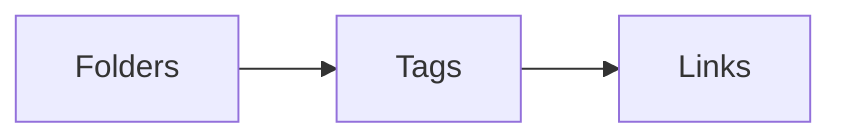
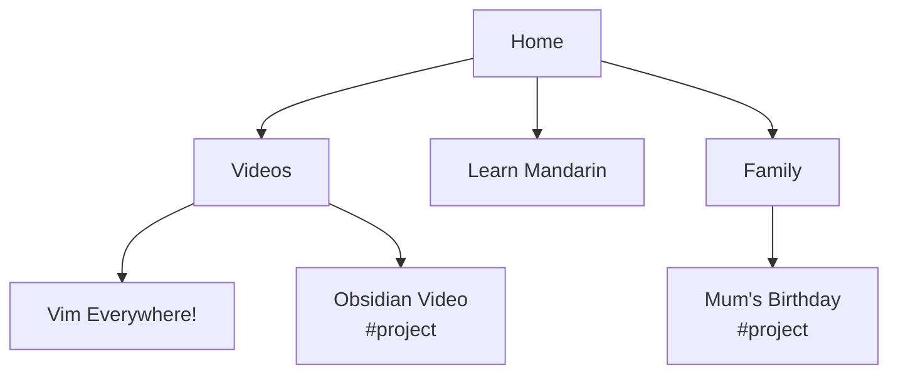
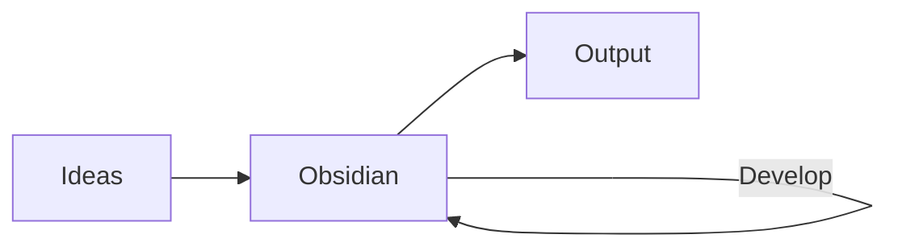

---
{"dg-publish":true,"permalink":"/no-boilerplate/obsidian-the-good-parts/","tags":["project/nb"],"noteIcon":"","created":"2025-01-29T21:33","updated":"2025-02-20T12:30"}
---


<svg alt="Obsidian" height="200" viewBox="0 0 20 25"  xmlns="http://www.w3.org/2000/svg"><path fill="#A88BFA" d="m6.91927 14.5955c.64053-.1907 1.67255-.4839 2.85923-.5565-.71191-1.7968-.88376-3.3691-.74554-4.76905.15962-1.61678.72977-2.9662 1.28554-4.11442.1186-.24501.2326-.47313.3419-.69198.1549-.30984.3004-.60109.4365-.8953.2266-.48978.3948-.92231.4798-1.32416.0836-.39515.0841-.74806-.0148-1.08657-.099-.338982-.3093-.703864-.7093-1.1038132-.5222-.1353116-1.1017-.0165173-1.53613.3742922l-5.15591 4.638241c-.28758.25871-.47636.60929-.53406.99179l-.44455 2.94723c.69903.6179 2.42435 2.41414 3.47374 4.90644.09364.2224.1819.4505.26358.6838z"></path><path fill="#A88BFA" d="m2.97347 10.3512c-.02431.1037-.05852.205-.10221.3024l-2.724986 6.0735c-.279882.6238-.15095061 1.3552.325357 1.8457l4.288349 4.4163c2.1899-3.2306 1.87062-6.2699.87032-8.6457-.75846-1.8013-1.90801-3.2112-2.65683-3.9922z"></path><path fill="#A88BFA" d="m5.7507 23.5094c.07515.012.15135.0192.2281.0215.81383.0244 2.18251.0952 3.29249.2997.90551.1669 2.70051.6687 4.17761 1.1005 1.1271.3294 2.2886-.5707 2.4522-1.7336.1192-.8481.343-1.8075.7553-2.6869l-.0095.0033c-.6982-1.9471-1.5865-3.2044-2.5178-4.0073-.9284-.8004-1.928-1.1738-2.8932-1.3095-1.60474-.2257-3.07497.1961-4.00103.4682.55465 2.3107.38396 5.0295-1.48417 7.8441z"></path><path fill="#A88BFA" d="m17.3708 19.3102c.9267-1.3985 1.5868-2.4862 1.9352-3.0758.1742-.295.1427-.6648-.0638-.9383-.5377-.7126-1.5666-2.1607-2.1272-3.5015-.5764-1.3785-.6624-3.51876-.6673-4.56119-.0019-.39626-.1275-.78328-.3726-1.09465l-3.3311-4.23183c-.0117.19075-.0392.37998-.0788.56747-.1109.52394-.32 1.04552-.5585 1.56101-.1398.30214-.3014.62583-.4646.95284-.1086.21764-.218.4368-.3222.652-.5385 1.11265-1.0397 2.32011-1.1797 3.73901-.1299 1.31514.0478 2.84484.8484 4.67094.1333.0113.2675.0262.4023.0452 1.1488.1615 2.3546.6115 3.4647 1.5685.9541.8226 1.8163 2.0012 2.5152 3.6463z"></path></svg>

# Obsidian

> ## THE GOOD PARTS

 
I have been using Obsidian for 5 years, deepening my thinking in conversation with my second brain.

Even without using the over 2000 powerful community-made plugins, Obsidian has excellent built-in features for a great many uses, if you know how to start building your data.


- ❌ Canvas Plugin
- `canvas.json`
- machine-readable


- ✅ Kanban Plugin
- `kanban.md`
- human-readable

 
There is no one right way to build your Obsidian second brain, but there are WRONG ways, and these pitfalls are important to know about.

The Good Parts prioritise plugins that keep the markdown portable, like the popular kanban plugin, which stores its columns as Markdown headings, and cards as bullets under those columns.
Canvas, despite being a core plugin made by the Obsidian team, is not part of the good parts because canvas is not aligned with the text-based graph of knowledge

This video is about the good parts of Obsidian, those that if you know about, you can use to make your second brain as complex as your first.

# ~~"Research"~~

# ~~Configuration~~

# ~~Procrastination~~

 

I don't know what it's called, but left to my natural inclinations, I seem to spend all my time sharpening my metaphorical axes instead of using them.

Not only do I end the day without cutting down any trees, but if this continues, I will have ground my axes down to nothing.

> [!QUOTE] Yak Shaving
> 1. _Any apparently useless activity which, by allowing you to overcome intermediate difficulties, allows you to solve a larger problem._
> 2. _The actually useless activity you do that appears important when you are consciously or unconsciously procrastinating about a larger problem._

 
It seems related to the problem, that in programming circles we call Yak Shaving.

Which is when you're doing:
1. An APPARENTLY useless set up task, OR
2. An ACTUALLY useless procrastination task
 
Preparing your tools is not the job, doing the job is the job.
And it's difficult, sometimes, to tell which you're really working on.

# Tasks

# Projects

# PKM

 
This illness tends to effect even highly motivated and productive people:
They know they have to be organised, so they use organisational apps, sites, and services to attempt this.


(they're almost all primary colours with a checkbox)

 

But new apps are being published all the time, and the existing ones release new features all the time, and it's difficult to keep up with the pace of all this change, not to mention when apps REMOVE features or even disappear altogether.

The result, all too often, is this hedonic treadmill of:
- Leaping to a new app,
- moving some, but not all, of your data and tasks and projects to it,
- and then sooner or later being unsatisfied and leaping again.

Hoping each time that your next leap will be the leap home.
Or something like that.


calendar, tasks, research, *this video* - everything

 
I have finally solved this problem for myself with Obsidian.
And not because it happened to have all the features I want today, but because it allows me to trivially build all future features I may need tomorrow.

> # DON'T USE
## The Bad Parts

 
But unlike many of the other good obsidian guides you can find on youtube, I'm also going to tell you what I wish people had told me when I got started:

**There are features of obsidian that you SHOULDN'T use.**


["Hacking Your Brain With Obsidian.md"](https://www.youtube.com/watch?v=DbsAQSIKQXk)

 
I'm not going to compare obsidian to other tools, nor give a beginner's guide on how to install it or use basic markdown formatting.

I already made that video, and you may watch that here.

In this video (which is not sponsored by Obsidian, I asked), I'm going to recommend how to best build your custom-made second brain that fits your individual first brain perfectly by using Obsidian's core Triumvirate of features.

> # Data and Metadata

## In the Same File

 
The golden rule that cuts through everything I will talk about today is this:

The data you're working on (which could be writing, music composition, studying, flashcards, or even thinking itself), should be stored IN THE SAME FILE as the metadata about it (which could be tags, tasks, notes and research, or even whole databases).

## Obsidian Hierarchies

> 1. ## 📂 `/FOLDERS/`
> 2. ## 📑 `TAGS`
> 3. ## 🔗 `[[LINKS]]`

 
The three common organisational tools inside obsidian you will hear about, folders, tags, and links, function to build hierarchies.
They all act as some kind of organisation to navigate our second brain and find information and relationships quickly.


Move your thinking to the right

 
The difference between these three is how rigid you need your hierarchy to be.

I'll briefly show you how Obsidian manages each, but the TLDR is that the more complex your system, the more you will want to move your thinking to the right of this chart.

And we'll start with the curse of FOLDERS.

# 📂

# Part 0

> # [`/FOLDERS/`]()


## Friends Don't Let Friends Use Folders

 
I consider folders the weapon of the enemy in obsidian because they do not play well with most of the other "Good Parts" of the system.
It is a trap nearly every new obsidian user falls in to.
And I was no exception.


 
Folders feel like a legacy feature that works very differently than all others:
- You add tags or links inside your notes, interwoven with the content, but folders exist outside them, and CAN'T be tagged or linked to.
- A file can only exist in a SINGLE folder, whereas you can link to many other files or use multiple tags.
- and, most damning of all: they don't show up on the beautiful graph view

**HOWEVER**

Folders are not completely terrible.
They work at the OS level, you can see them on a USB drive, SD card, or uploaded to a third-party service without having obsidian installed.
That ain't nothing.

## Folders in Their Natural Habitat


 
But we're not filing customer records, we're building our second brain.

Folders don't exist in our brains.
They are a physical limitation of paper.

And there is no paper here.

<grid  drag="50 50" drop="left" pad="20px">


Left: Xerox Star, 1981.

</grid>

<grid  drag="50 50" drop="right" pad="20px">


Right: Mac OSX, 2023

</grid>

 
Folders are not part of my Good Parts.

And if you take my advice, you won't voluntarily make a single one, relying instead on tags and links, and, as I'll explain, Obsidian properties

# Part 1

# [#Tags]()

## Think You Know Tags?

> [#you/may/be/surprised]()

 
As you know, tags are good for categorisation, they are more flexible than folders, as a note can have many tags. But in Obsidian, it's more than that, there is the concept of parent and child tags

> `#dog/corgi/ein`

&mdash; Just one good doggo

> `#dog`

&mdash; A lot of good doggos

 
In this example, searching for the whole "dog-corgi-ein" tag only gets notes tagged with this one dog, but searching for the `#dog` tag gets notes for all dogs, no matter what breed or name they have.

> ## `#project`

&mdash; All my projects

> ## `#project/noboilerplate`

&mdash; All my videos

> ## `#project/noboilerplate/43`

&mdash; Notes related to my 43rd video

 
So in Obsidian, you may build a folder-like hierarchy without the constraints of a file being inside only one folder, external to the note data.

This doesn't solve the problem that there is no such thing as a tag note, but it's better than folders.

In addition to placing tags in the body of your note, they can also go in the note properties, which is an extremely exciting feature that is the foundation of all my systems, and that I'll explain in just a moment.

> # PARA Tags

- ## # Project
- ## # Area
- ## # Resource
- ## # Archive

 
To get started, you could do a lot worse than using just the four tags of [Tiago Forte's PARA system](https://fortelabs.com/blog/para/), these are the ONLY tags you're likely to need to start off building your brain.
Don't use tags for metadata, just for simple grouping like this.

Properties & Links are the real secret sauce of The Good Parts.


## [Patreon.com/NoBoilerplate](http://www.patreon.com/noboilerplate)

- 🦆 Duck Typing with Properties
- 📁 My downloadable template starter vault

 
If you'd like to listen to my thoughts on duck typing with obsidian properties, or to download my template starter vault using the Good Parts, patrons of all levels can access this here.

It's just me running this channel, and I'm so grateful to everyone for supporting me on this wild adventure.

If you'd like to see and give feedback on my videos up to a week early, as well as get private discord access, and even your name in the credits, it would be very kind of you to check my Patreon.

I'm also offering a limited number of mentoring slots. If you'd like 1:1 tuition on personal organisation, Rust, creative production, web tech, or anything that I talk about in my videos, do sign up and let's chat!


# Part 2
> # [Properties]()

```yaml
tags:
  - project/nb
start:     2024-07-31
due:       2025-01-31
scheduled: 2024-12-10
titles:
  - "Building Your Second Brain In Obsidian"
  - "The Obsidian Triumvirate"
  - "Hacking your brain with obsidian 2"
up:
  - "[[No Boilerplate Index]]"

Like many of us, I suffer from a sickness.
```
<!-- element style="font-size: 25px;" -->

 
- tags can go in the properties, as we've seen
- but the properties can contain anything
- Because it's not just a pretty table of metadata at the front of your notes
- when using properties you can treat your whole second brain like a simple database, which is hugely powerful and core to my principle of building everything inside obsidian in plain text

```yaml
Inline properties exist such as:

It's over [power_rating:: 9000]!

But I keep in the fonrtmatter, just like #inline/tags
```

I'm not sold on inline metadata and tags.

 
While inline properties exist, I prefer to keep everything organised in the frontmatter of my notes.

# 🔗

# Part 3

> # \[\[[LINKS]()\|LINKS]()]]

 
- Links are the most flexible, powerful, and therefore complex, part of the system.
- But you must be cautious.

## The Good Parts
- ✅ \[\[`wikilinks`]]
- ✅ \[\[`wikilinks`|`with an alias`]]
- ✅ \[\[`wikilinks#To A Heading`]]

&nbsp;
## The Bad Parts
- ⛔ \[\[`absolute/wikiliks`]]
- ⛔ \[`markdown`](`links`)
- ⛔ \[`absolute`](`markdown/links`)

 
I recommend using the simplest link syntax, putting square brackets around the note name.
This wikilink format also supports an alias, which is text that is shown instead of the name of the note.

Don't use absolute paths or markdown links, unless you are interfacing with an external system that requires them (you'll know if you are)

Wikilinks are the best of all worlds, as if there are ever two files with the same name in different folders, Obsidian detects this and qualifies the path.

Obsidian keeps track of all links in your vault, and if you ever rename a note, the links are updated to keep them from breaking.
(I wish that happened on the Internet!)

HOWEVER, at time of recording, it doesn't do this for aliases or heading links. Both these features are so useful, they quite make up for this, but do be aware of this surprising edge case.

## A Secret Obsidian Feature
## `[Named:: [[Links]]]`

 
There's a feature I use every day that I don't think most people know about.

```yaml
up:
- [["LT Season 17.0"]]
prev:
- [["LT17.4"]]

## Act 1
 ---
Hello world, I have made
```


The Juggl plugin

 
Obsidian's inline properties can have links as their values.
This allows you to make what I call "named links". I don't know if this is a term that is used in the community, but using these two features together allows us to create named relationships between our notes.
Relationships could be:
- parent-child
- source-citation
- east-west
- previous-next
- and so on, whatever ontology want.

This is fully supported by the obsidian search and backlinks system, all plugins, too, but now you can filter by the TYPE of link.


Very pretty, but even *I* don't know what's going on _(and it's MY brain)_

 
This is why Named Links are enormously powerful because not all relationships, and therefore links, are equal, and if you just use regular links, the meaning is obfuscated.

The reason the graph view is a pretty toy is that you can't see what kind of links each line represents, you have to click into the note and read the context to understand.
What is this, the dark ages?
Use named links, and suddenly the relationships are apparent, and you can build a navigable ontology of your brain

```mermaid
flowchart TD;

Home |up| Videos  |up| NB
Home |up| Podcasts |up| S16

subgraph S16[Lost Terminal Season 18]
direction LR
    LT18.1[LT18.1 #project] |next| LT18.2
end

subgraph NB[No Boilerplate]
    direction LR
    Obsidian_Video[Obsidian: The Good Parts #project] |prev| Vim_Everywhere[Vim Everywhere!]
end

```

## Blending This All together



 
Whatever system you build will be advisory, of course it should be as comprehensive as possible, but it will never be perfect.
But using The Good Parts allows structure to emerge organically, from the bottom up.
It doesn't matter where the notes physically are, we are gardeners, not architects, when building our second brain in Obsidian.

## Obsidian as a Holistic Thought System



 

## Obsidian is a

> # Knowledge Platform
## Not a Wiki

 
Despite first impressions, Obsidian ISN'T a personal wiki:
It's a general purpose knowledge platform that allows you to build whatever systems you want, the *default application of which* is a personal wiki.

You can build anything on top of the simple framework I'll teach you today:
- A todo system filtered by contexts, dates, priorities, and projects
- A writing environment for fiction or non-fiction, with queryable character timelines, references, or D&D monster stats,
- You can even build a youtube career on it if you're especially lucky.

All these uses, and any others that you could imagine, you can build yourself, living in the same place, not in 10 different apps, with your data safely offline on your own computer, phone, or tablet.

If you build your second brain with this powerful triumvirate, you will be working in alignment with how Obsidian works, not fighting against it, building a flexible foundation that can scale to thousands of notes.

# Obsidian
## [The Good Parts]()

> ## ~~📂 `/FOLDERS/`~~
> 1. ## 🪪 `[[PROPERTIES]]`
> 2. ## 🔗 `[[LINKS]]`
> 3. ## 📑 `#TAGS`

 
The good parts, in summary:

- no folders
- named links for strong relations
- regular links for weak relations
- and tags to break out of this hierarchy

When you do all of your working and thinking inside a single platform that you don't just use, but control and build, you get this marvellous force multiplier with every project you bring into it.

I'm excited for you: Start building your second brain using The Good Parts today.

# Thank You

To all my patrons, you make this possible!

```rust
let producers: [&str; 0] = [];
let sponsors = [
	"Jaycee", "Gregory Taylor", "Ything LLC"
];
let patrons: [&str; 480];
```

## [Patreon.com/NoBoilerplate](http://www.patreon.com/noboilerplate)

## [ko-fi.com/noboilerplate](https://ko-fi.com/noboilerplate)

 
If you would like to support my channel, get early ad-free and tracking-free videos, your name in the credits or 1:1 mentoring, head to my patreon or ko-fi.

If you're interested in transhumanism and hopepunk, please check out my weekly sci-fi audiofiction podcast, Lost Terminal.

I just finished Season 2 of The Phosphene Catalogue, if you like mysteries and art, check it out!

Transcripts and compile-checked markdown sourcecode are available on namtao.com and github, links in the description, and corrections are in the pinned ERRATA comment.

Thank you so much for watching, talk to you on Discord.

 