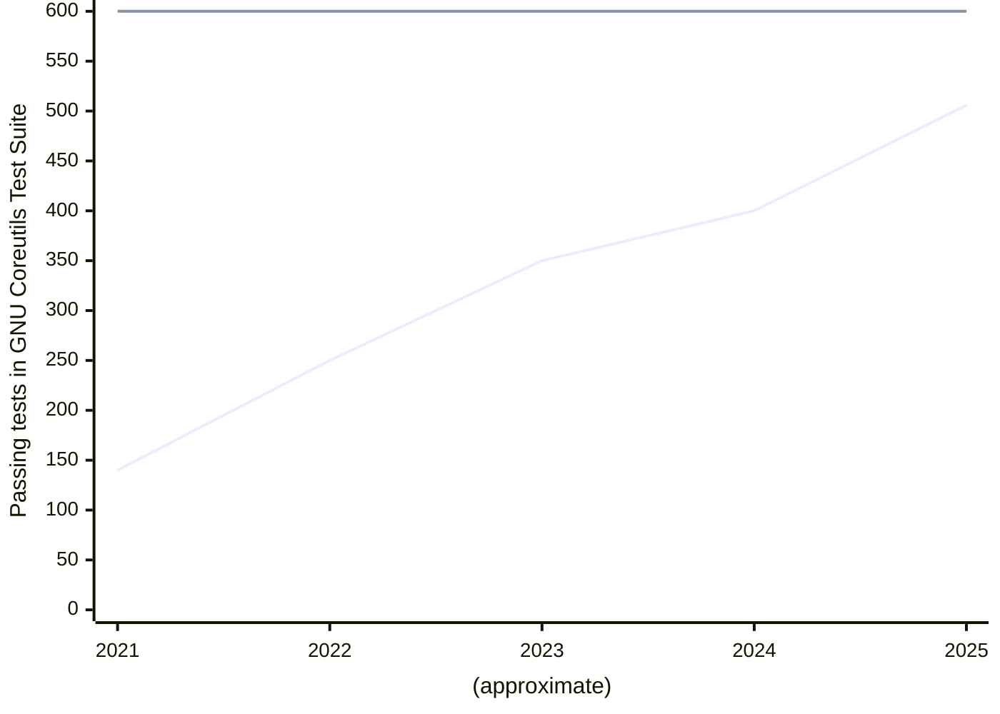
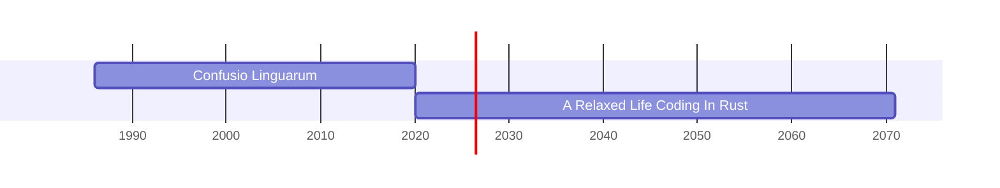

---
{"dg-publish":true,"permalink":"/rust-is-the-new-c/","tags":["project"],"noteIcon":"","created":"2025-02-21T11:46","updated":"2025-03-18T08:19"}
---


<iframe title="Rust is the New C" width="560" height="315" src="https://makertube.net/videos/embed/ac1f333b-23eb-47e7-8aa4-7373cf79e57e" frameborder="0" allowfullscreen="" sandbox="allow-same-origin allow-scripts allow-popups allow-forms"></iframe>

<!--section: 2.1.1.1-->
<!-- speaker_note: |
Hi friends, my name is Tris and this is No Boilerplate, where I make fast, technical videos.

Here's something I think about often:
-->

<!--section: 2.2-->
The 1970s: What a time for computing
===

<!--section: 2.2.1-->
<!-- new_lines: 3 -->

<!-- column_layout: [2,3,2] -->
<!-- column: 0 -->

## 1970


A PDP-11 minicomputer

`Alien`

<!-- column: 1 -->

## 1975


<!-- new_lines: 1 -->
The first personal computer

`Alien`

<!-- column: 2 -->
## 1981


The first IBM PC

`Familiar`

<!-- reset_layout -->

<!--section: 2.2.1.1-->
<!-- speaker_note: |
 
THE 70s MUST HAVE BEEN A WILD TIME TO BE ALIVE, right?

At the start of the decade, electronic calculators were not seen outside of laboratories, but by 1974 they were in every home.

Video games like Pong introduced computer power to the general public, and by the late 70s it was looking like the microcomputer revolution would mean every house would have a computer, just like they suddenly had calculators.

Against this backdrop, the C programming language was written, first for the PDP-11, then ported to basically every computer that has ever been built.

I often daydream about the lives of people who picked up C just at this perfect time, right at the start.

-->

<!--section: 2.2.2-->

<!-- column_layout: [1,1] -->

<!-- column: 0 -->

> [!NOTE]
> _I will refer to both C and C++ interchangeably as "C" in this video._
> &nbsp;
> My apologies.

<!-- column: 1 -->

<!-- reset_layout -->

<!--section: 2.2.2.1-->
<!-- speaker_note: |
After they learned this relatively small language, they could then have spent DECADES writing JUST C, one language (one ish languages) for all programs, on all devices!

-->

<!--section: 2.2.3-->
C Will Never Die
===


<!--section: 2.2.3.1-->
<!-- speaker_note: |

C is doggedly refusing to leave Redmonk's top 10 languages, by github projects and stackoverflow tags.

everything was, and to a large extent, still is, written in C:
- Games
- spreadsheets
- device drivers
- Operating Systems
- Firmware
- and even web and phone apps

But there's only one language that can do all of this today, and it ain't C.

-->

<!--section: 2.3-->

<!--section: 2.3.1.1-->

<!--section: 2.4-->
Grace Pointer's CV (or Perhaps "C++V")
===

<!--section: 2.4.1-->
<!-- column_layout: [1,7,3,1] -->
<!-- column: 0 -->

<!-- column: 1 -->

| `DATE` | `POSITION`                  | `COMPANY`   |
| ------ | ------ | -- |
| _1978_ | **Mainframe Development**   | IBM         |
| _1983_ | **Word 1.0**                | Microsoft   |
| _1989_ | **Excel 1.0**               | Microsoft   |
| _1994_ | **Web development**         | Yahoo       |
| _2001_ | **Game development**        | ID Software |
| _2009_ | **Mobile App Dev**          | Apple       |
| _2020_ | **AI CUDA Dev**             | Wolfram     |
| _2025_ | **Open Source Contributor** | Various     |

<!-- column: 2 -->


(Graphics design is my passion)

<!-- reset_layout -->

<!-- new_lines: 2 -->

> A whole career in a _single_ language!

<!--section: 2.4.1.1-->
<!-- speaker_note: |
 
Lets imagine what her career could have looked like right up until today:
 - minicomputer application development in the late 70s
 - desktop application development in the early 80s
 - by the late 80s, she started using this new thing called C++
 - then Windows and mac desktop software in the early 90s
 - and cgi web applications in the early web of the late 90s
-->

<!--section: 2.4.2-->
CGI RFC3875
===

<!-- new_lines: 3 -->

> [!NOTE]  The Common Gateway Interface (CGI) Version 1.1
> For UNIX compatible operating systems, the following are defined:
> &nbsp;
> - *Meta-Variables*
> &nbsp;
>     Meta-variables are passed to the script in identically named environment variables. These are accessed by the `C library routine getenv()` or variable environ.

<!-- new_lines: 2 -->

&mdash; https://www.rfc-editor.org/rfc/rfc3875#section-7.2

<!--section: 2.4.2.1-->
<!-- speaker_note: |
The CGI spec was written assuming c, even in 1.1, last revised in 2004 - okcupid.com is *still* written in c!
C is vital to all webapps even to this day: if you look inside every python, ruby, and javascript app, the power behind the throne is the huge modules written in C
-->

<!--section: 2.4.3-->
<!-- end_slide -->
- repeat grace slide

<!--section: 2.4.3.1-->
<!-- speaker_note: |
 
  - Grace then tracked the explosion of game development in the 2000s
  - And even got on the objective-C train with iphone app development
  - during the AI explosion, she was writing GPU AI code, using Nvidia's CUDA platform, you guessed it, written in C
  - HER SKILLS ARE STILL RELEVANT NOW SHE'S RETIRED
    - She can still do everything TODAY - how wild is that! Compare this to every other field. Not just teaching her skills, but the code she writes is relevant still, and will be, very likely, for her whole life. She remains a core contributor to a dozen open source projects that run on millions of machines around the world.

A whole career in a single language, compare that to the 12 new javascript preprocessors that came out yesterday!
  
Grace's career sounds much more relaxing, doesn't it?
(null pointers notwithstanding, of course)
This is my pitch to you for your future, if you learn Rust TODAY.
-->

<!--section: 2.5-->
<!-- end_slide -->

<!--section: 2.5.1-->
<!-- new_lines: 3 -->

> [!QUOTE] C Developers
> "Lisp developers know
> the *value* of everything
> and the *cost* of nothing"

<!-- new_lines: 2 -->

<!-- new_lines: 2 -->

*this is, naturally, applied to all other languages

<!--section: 2.5.1.1-->
<!-- speaker_note: |
 
Let's take a step back: Why did C come to dominate our industry? in short, Low-level portability. Why is it STILL so relevant? low-level portability; write once, compile everywhere. Before C it was understood that if you wanted portability you had to sacrifice low-level power and speed, and vice versa:
If you wanted to write operating systems and games that needed to run FAST, you had to write low-level assembly for your specific architecture, and then rewrite it almost entirely for each new machine.

-->

<!--section: 2.6-->
Language Comparison
===

<!--section: 2.6.1-->
<!-- column_layout: [1, 8, 4, 1] -->
<!-- column: 1 -->

<!-- new_lines: 2 -->

|          | C   | JS  | Py  | Zig | Go  | Rust |
| ---- | --- | --- | --- | --- | ---| - |
| Frontend | `1` | ✅   |     | `1` | `2` | ✅    |
| Backend  | ✅   | ✅   | ✅   | `1` | ✅   | ✅    |
| Games    | ✅   | ✅   |     | ✅   | ✅   | ✅    |
| ML/AI    | ✅   |     | ✅   | ✅   | `3` | ✅    |
| Desktop  | ✅   | ✅   | ✅   | ✅   | ✅   | ✅    |
| Driver   | ✅   |     |     | ✅   |     | ✅    |
| O/Ses    | ✅   |     |     | ✅   |     | ✅    |
| Linux    | ✅   |     |     |     |     | ✅    |

<!-- column: 2 -->

`1` _While it is possible to write web C/Zig code, it's not fun_

`2` _Webasm isn't a native to Go, it requires the tinygo compiler_

`3` _You can CALL GPU functions in Go, you can WRITE them in Rust_

<!-- reset_layout -->

> [!NOTE] Note
 > (This is all very approximate, please don't take this too seriously)

<!--section: 2.6.1.1-->
<!-- speaker_note: |
 

This reminds me of where we are today, where as generalist software developers, we write javascript for browser development, backend code in python, ruby or nodejs, and bare metal code still requires C, or perhaps Zig, if you're lucky. And if you want to do ios or windows application development, apple or microsoft have some very reasonably priced toolkits to show you.

There is only one language today that allows you to follow Grace Pointer's example, and it's no longer C, and it's not js.
As web development has moved to high-level languages, leaving c behind, Rust is the only language that can do it all.
Yes, some of these applications are **possible** in other languages as well as C, but no-one would argue that would be FUN.
-->

<!--section: 2.7-->
Popularity Matters
===

<!--section: 2.7.1-->
<!-- new_lines: 5 -->

> [!QUOTE] Raffi Molero, video comment
> "If you almost *never add* anything, *you get C*.
> If you almost *never remove* anything, *you get C++*."

<!--section: 2.7.1.1-->
<!-- speaker_note: |

C takes backwards compatibility extremely seriously, with a pace of development that only a mother could love.

High-level languages tend to have more of a fcuk it, ship it attitude. When new features are added you are expected to keep up with the pace of development if you want them. (React developers know what I'm talking about)
-->

<!--section: 2.8-->
Rust Editions
===

<!--section: 2.8.1-->
<!-- new_lines: 5 -->

> [!QUOTE] Graydon Hoare
> "Rust is over-engineered for survival"

<!--section: 2.8.1.1-->
<!-- speaker_note: |

Rust has learned from C and Cpp, eschewing a middle road comprimise, instead taking a quantom superpositon of BOTH SIMULTANEIOUSLY
It is both uncomprimisingly backwards and uncomprimisingly forwards compatible.
This is guarenteed by the Rust Editions system, ensuring that libraries expecting different versions of Rust can still be compiled together in a single project.

forwards compatibility is also augmented at a less formal level with the macro system.

-->

<!--section: 2.9-->
Rust Macros are Witchcraft
===

<!--section: 2.9.1-->

```rust
let n = await!(some_future_computation); //fixed
```

Expands to roughly:

```rust
let mut future = IntoFuture::into_future($expression);
let mut pin = unsafe { Pin::new_unchecked(&mut future) };
let n = loop {
    match Future::poll(Pin::borrow(&mut pin), &mut ctx) {
          Poll::Ready(item) => break item,
          Poll::Pending     => yield,
    }
}
```

> [!NOTE] Rust RFC-2394
> "`await!` is a compiler built-in to leave space for deciding its exact syntax later."

<!--section: 2.9.1.1-->
<!-- speaker_note: |

Like in Lisps, Rust macros make the whole language available at compile time to rewrite the syntax before passing the generated code to the compiler.

This is a wildly powerful trick that deserves separate discussion, see my Witchcraft video for that.

A concrete example of this forwards compatibility was with the `await!` macro, introduced to rust for testing while the community was figuring out if they wanted an await keyword, like Javascript, or to .await on a future.

The latter won out, but no core language changes were needed to test it in real code - macros allow the new syntax to be a library.

-->

<!--section: 2.10-->
Part 2: All the things you can do with Rust
===

<!--section: 2.10.1-->


<!-- column_layout: [2,2,2] -->
<!-- column: 0 -->

<!-- column: 1 -->

(image unrelated)
<!-- column: 2 -->

<!-- reset_layout -->

<!--section: 2.10.1.1-->
<!-- speaker_note: |
Here is speedrun of all the things you can build if you learn rust, a single language, in 2025:
-->

<!--section: 2.11-->
🌐 LEPTOS.dev
===

<!--section: 2.11.1-->
<!-- column_layout: [3,2] -->
<!-- column: 0 -->

```rust
#[component]
pub fn button() -> impl IntoView {
  let (count, set_count) = signal(0);
  view! {
    <button on:click=move |_| {
      set_count.update(|n| *n += 1);
    }>
      "Click me: " {count}
    </button>
  }
}
```

<!-- column: 1 -->


- Backend
- Frontend
- Full stack
- Fully typed

<!-- reset_layout -->

<!--section: 2.11.1.1-->
<!-- speaker_note: |
Until you, my lovely audience, decided I should be a YouTuber, I was a web developer.
It's my favourite way to publish programs that users interact with.
The browser is an operating system unto itself, chromebooks certainly think so, and you can use it to make far more then pretty web pages.
Because you have access to the full suite of browser apis, you can:
- make music with webaudio
- write GPU accellerated games with WebGL and WebGPU
- Store data securily on the user's machine in local storage,
- and even communicate with low-level connected hardware (like kbs and mesh radio transcievers!) using webserial

ALL THIS ECOSYSTEM is only available to javascript and languages that compile to webassembly, the most popular of which is of course, Rust.

Javascript developers are half right in thinking they have a job and language for life...
EXCEPT to do what Leptos is doing here, embedd html/RSX-like syntax, you need external build tools, so enjoy (re)learning that ecosystem for each new framework.
In Leptos, as in every Rust project, build tools are a macro away.
The one used here on line 4 is called `view!`, you can tell a macro is being called because the compiler requires them to be named with a bang at the end of their name.
-->

<!--section: 2.12-->

<!--section: 2.13-->
Tauri Replacing Electron for Mobile
===

<!--section: 2.13.1-->
<!-- column_layout: [3,2] -->
<!-- column: 0 -->

```bash
# Android
tauri android build -- --aab

# iOS / macOS
tauri build --bundles app \
  --target universal-apple-darwin

# Windows Store
tauri build -- --no-bundle
```

<!-- column: 1 -->

Tauri supports:
- Android
- iOS
- Microsoft Store
- Windows installer
- Appimage
- Flathub
- Debian
- AUR
- and more

<!-- reset_layout -->

<!-- new_lines: 2 -->

> [!NOTE]
> All using with 90% less disk space than Electron, a _hello world_ is 600KB

<!--section: 2.13.1.1-->
<!-- speaker_note: |

But what if you want your webapp to run offline on the user's device?

No need to reach for Electron, Tauri is a rust-powered replacement supporting every store out there.
-->

<!--section: 2.13.2-->
Poem + HTMX
===

<!-- column_layout: [1,8] -->

<!-- column: 0 -->

<!-- new_lines: 1 -->
> Poem

<!-- new_lines: 8 -->

> HTMX

<!-- column: 1 -->

```rust
#[oai(path = "/hi", method = "get")]
async fn index(&self, name: MyQuery) -> PlainText<String> {
    match name.0 {
        Some(name) => PlainText(format!("hi, {}!", name)),
        None => PlainText("hello!".to_string())}}
```

<!-- new_lines: 2 -->

```html
<div id="me"></div>
<button hx-post="/hi" hx-target="#me" hx-swap="outerHTML">
  Click Me
</button>
```

<!-- reset_layout -->

<!--section: 2.13.2.1-->
<!-- speaker_note: |

Write your native device code in Rust, and your application code in Rust, maybe even Poem and HTMX, here.
A simple, type-checked backend plus a simple frontend, wonderful!

-->

<!--section: 2.14-->
Windows crate
===

<!--section: 2.14.1-->
<!-- column_layout: [4,5] -->
<!-- column: 0 -->

- Full access to all windows apis, wrapped in an idiomatic rust interface
- Stop laughing it's actually genius
- You can even compile windows for ARM binaries
- The `windows-sys` crate is available for ~~masochists~~ the low-level apis

<!-- column: 1 -->

```rust
use windows::{
    core::*, 
    Win32::UI::Shell::*, 
    Win32::UI::WindowsAndMessaging::*};

fn main() {
    unsafe {
        MessageBoxA(
            None, 
            s!("Hello"), 
            s!("World"), 
            MB_OK);
    }
}
```

<!-- reset_layout -->

<!--section: 2.14.1.1-->
<!-- speaker_note: |

Not native enough?

All windows apis are available in the `windows` crate, from messageboxes to audio, file system, and networking,

(Tauri actually uses this crate for some of its own native functionality)

-->

<!--section: 2.14.2-->
DirectX12 Example
===

<!-- column_layout: [3,4] -->
<!-- column: 0 -->


All windows apis **INCLUDING DIRECT3D** are available in the `windows` crate.

<!-- column: 1 -->

```rust
fn create_vertex_buffer(
    device: &ID3D12Device,
) -> D3DResult {
    let vertices = [
        Vertex {
            position: [0.0, 0.25, 0.0],
            color: [1.0, 0.0, 0.0, 1.0],},
        Vertex {
            position: [0.25, -0.25, 0.0],
            color: [0.0, 1.0, 0.0, 1.0],},
        Vertex {
            position: [-0.25, -0.25, 0.0],
            color: [0.0, 0.0, 1.0, 1.0],},
    ]; //...
```

<!-- reset_layout -->

<!--section: 2.14.2.1-->
<!-- speaker_note: |
EVEN DIRECT3D is available, write your next native windows game using it!
-->

<!--section: 2.15-->
Game Dev with Bevy/Godot
===

<!--section: 2.15.1-->
<!-- column_layout: [6,5] -->
<!-- column: 0 -->

```rust
#[derive(GodotConvert, Var, Export)]
#[godot(via = GString)]
pub enum Planet {
    Earth, 
    Mars,
    Venus,
}
#[derive(GodotClass)]
#[class(base=Node)]
pub struct SpaceFarer {
    #[export]
    favorite_planet: Planet,
}
```

<!-- column: 1 -->


> [!NOTE] See more
> https://godot-rust.github.io/
> &nbsp;
> https://bevyengine.org/

<!-- reset_layout -->

<!--section: 2.15.1.1-->
<!-- speaker_note: |
Don't want to write your game engine from scractch? Me either!

Godot has native support for Rust, and if you'd like the engine to be written top-to-bottom in Rust, the Bevy project might be just what you need!
-->

<!--section: 2.16-->
ML/AI Computing
===

<!--section: 2.16.1-->
Matrix addition running natively on the GPU with CUDA and the `cuda_std` crate.

```rust
#[kernel]
pub unsafe fn add(a: &[f32], b: &[f32], c: *mut f32) {
    let idx = thread::index_1d() as usize;
    if idx < a.len() {
        let elem = &mut *c.add(idx);
        *elem = a[idx] + b[idx];
    }
} 
// eg, [1,2,3,4] + [1,2,3,4] = [2,4,6,8]
```

> [!NOTE] See more
> https://rust-gpu.github.io/

<!--section: 2.16.1.1-->
<!-- speaker_note: |

Running massively parallel workloads on comodity GPU hardware has been made much more accessbile by nVidia's CUDA framework.
FOR BETTER AND WORSE

And while bindings exist that allow other languages such as python to offload computation to the GPU, what you're looking at in this example is the actual code that RUNS on the GPU.

The `cuda_std` crate compiles rust directly into native gpu code.

This is something that previously was only supported using C, C++ and (Am I reading this right?) FORTRAN. OK we HAVE to see some of that  

-->

<!--section: 2.17-->
From nVidia's CUDA Fortran examples
===

<!--section: 2.17.1-->
<!-- column_layout: [2,1] -->
<!-- column: 0 -->

```js
real :: array(1000, 10)
integer :: i, j, n, m
!$acc data create(n, m) copy(array)
!$acc kernels
n = 1000
m = 10
!$acc end kernels
!$acc parallel loop defualt(none) collapse(2)
do j=1,m
  do i=1,n
    array(i, j) = i+j
  end do
end do
```

<!-- column: 1 -->

Incredibly `presenterm` doesn't have specific syntax highlighting for fortran.

I know, I'm shocked too.

<!-- reset_layout -->

[Further reading for the extremely curious](https://docs.nvidia.com/hpc-sdk/)

<!--section: 2.17.1.1-->
<!-- speaker_note: |

OK, cool! wow fortran's alive and well in high performance computing, eh?

Moving on!

-->

<!--section: 2.18-->
Asahi Linux
===

<!--section: 2.18.1-->
<!-- column_layout: [3,2] -->
<!-- column: 0 -->


<!-- column: 1 -->
Install on ANY M1/M2 machine
```sh
curl https://alx.sh | sh
# after install:
dnf upgrade --refresh
dnf install steam 
```

<!-- reset_layout -->

> [!important]  https://asahilinux.org/2024/10/aaa-gaming-on-asahi-linux/
> "The hardware is happy because the system is 16K, the game is happy because the virtual machine is 4K, and you’re happy because you can play Fallout 4."

<!--section: 2.18.1.1-->
<!-- speaker_note: |
What the asahi linux team have done to get linux working on apple silicon is nothing short of mirculous
An early breakthrough for the team was after they reverse-engineered the propriatory apple silicon GPU, they then wrote a driver for it using Rust.
They did this to sidestep the manual memory management, and inevitable bugs that driver code is plagued with if you write it in C.

You don't just get some free language features when you chose Rust, you get superpowers, in this case, speed of development.
The first version of this driver was written by Asahi Lina in 5 weeks, a success she attributes to her language choice.
I don't regularly write entire drivers from scratch, but that does sound very fast!

By the way, if you'd like try asahi linux, you can dual boot any m1 or m2 machine with this single command
-->

<!--section: 2.19-->
Uutils Coreutils
===

<!--section: 2.19.1-->
<!-- column_layout: [4,2] -->
<!-- column: 0 -->



> All coreutils have already been rewritten.
> By ~2026 it will be 100% compliant with GNU coreutils.

<!-- column: 1 -->

All my friends are invited:
- `cat`
- `chown`
- `cp`
- `date`
- `dd`
- `echo`
- `hostname`
- `kill`
- `ls`
- `mv`
- `pwd`
- `rm`
- `uname`
- `whoami`
- and more!

<!-- reset_layout -->

<!--section: 2.19.1.1-->
<!-- speaker_note: |

uutils is an attempt at rewriting the core unix CLI utilities in Rust. It is available for Linux, Windows, Mac and other platforms.

Yes, it's currently 7x larger than the extremely cut-down busybox (13MB on my machine), but busybox doesn't attempt to pass all the gnu coretils tests.
Uutils, as you can see, is nearly there.

original image: https://raw.githubusercontent.com/uutils/coreutils-tracking/main/gnu-results.png

-->

<!--section: 2.20-->
Bare-metal Rust
===

<!--section: 2.20.1-->
<!-- column_layout: [2,1] -->
<!-- column: 0 -->

```rust
//imports omitted
fn main() -> ! {
    let mut led = Output::new(
        peripherals.GPIO7, 
        Level::Low, 
        OutputConfig::default());
    led.set_high();
    let delay = Delay::new();
    
    loop {
        led.toggle();
        delay.delay_millis(500);
    }
}
```

<!-- column: 1 -->


Docs: `docs.esp-rs.org`

Code:
`esp-rs/esp-idf-hal`
or
`esp-rs/esp-hal` (no_std)

<!-- reset_layout -->

(though this is for ESP32, other brands are available.)

<!--section: 2.20.1.1-->
<!-- speaker_note: |
While an undesirable effect in physical engineering, I am extremely excited that I can write bare-metal rust, by which I mean rust running directly on real-time chips, for robotics or low-power sensor use.
Or maybe, even satalites!
-->

<!--section: 2.21-->
Things people who have never compiled Rust say:
===

<!--section: 2.21.1-->
<!-- column_layout: [3,1] -->
<!-- column: 0 -->

> "You can't write a *kernel* in anything other than C."

<!-- new_lines: 1 -->
> "You can't write *web apps* in a systems language."

<!-- new_lines: 1 -->
> "You can't *prototype* in Rust, the compiler is too slow"

<!-- new_lines: 1 -->
> "*Macros* are too confusing, no-one uses them."
 
<!-- new_lines: 1 -->
> "You can't write *game engines* in languages other than C++."

<!-- new_lines: 1 -->

<!-- column: 1 -->

<!-- new_lines: 11 -->

<!-- reset_layout -->

<!--section: 2.21.1.1-->
<!-- speaker_note: |
Over the course of my short Rust career so far, I have read every counterarguement by people who have never compiled a line of rust.
They tell me I can't write low-level performant code, or high-level fast prototypes, or browser-based apps, or games, or whatever their pet domain is.

If you hear these opinions, don't get stressed and argue with them, tell them what I say:

Just you watch me.

-->

<!--section: 2.22-->
I Can Finally Chill
===

<!--section: 2.22.1-->
<!-- new_lines: 2 -->



<!-- new_lines: 6 -->

(This graph is not as funny to me as I thought it was going to be, seeing that red line)

<!--section: 2.22.1.1-->
<!-- speaker_note: |

- c's low-level portability was important for a time when high-level languages only meant portability
- that's not the case any more, we expect far more of our high level languages: ergonomics, rapid prototyping, excellent tooling and deployment, and web-first interfaces
- rust can do them all, combined with the low-level efficiencies that games, robotics, and operating systems require

I'm so relieved that just like Grace Pointer, I have found a single language I can write all my projects in.
Perhaps for the rest of my life.

I can finally chill.
-->

<!--section: 2.23-->
Thank You!
===

<!--section: 2.23.1-->
To all my patrons, you make this possible.

<!-- new_lines: 1 -->

```rust
let producers: [&str; 0] = [];
let sponsors = [
 "Jaycee", "Gregory Taylor", "Ything LLC"
];
let patrons: [&str; 887];
```

<!-- new_lines: 1 -->
I'd be very grateful for your support on:

- [Patreon](http://www.patreon.com/noboilerplate)
- [Ko-Fi](https://ko-fi.com/noboilerplate)
- [Gumroad](https://namtao.gumroad.com)

<!--section: 2.23.1.1-->
<!-- speaker_note: |
 
If you would like to support my channel, get early ad-free and tracking-free videos, your name in the credits or 1:1 mentoring, head to my patreon or ko-fi.

If you're interested in transhumanism and hopepunk, please check out my weekly sci-fi audiofiction podcast, Lost Terminal.

I just finished Season 2 of The Phosphene Catalogue, if you like mysteries and art, check it out!

MODEM PROMETHEUS IS OFF HIATUS
go to modemprometheus.com to subscribe

Transcripts and compile-checked markdown sourcecode are available on namtao.com and github, links in the description, and corrections are in the pinned ERRATA comment.

Thank you so much for watching, talk to you on Discord.

-->

<!--section: 3-->

 