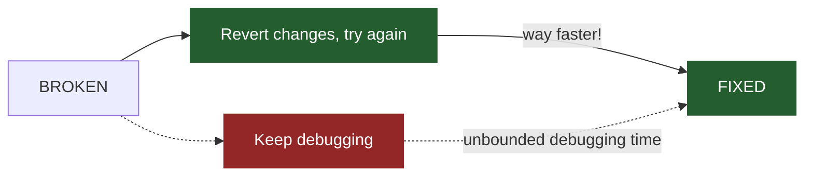
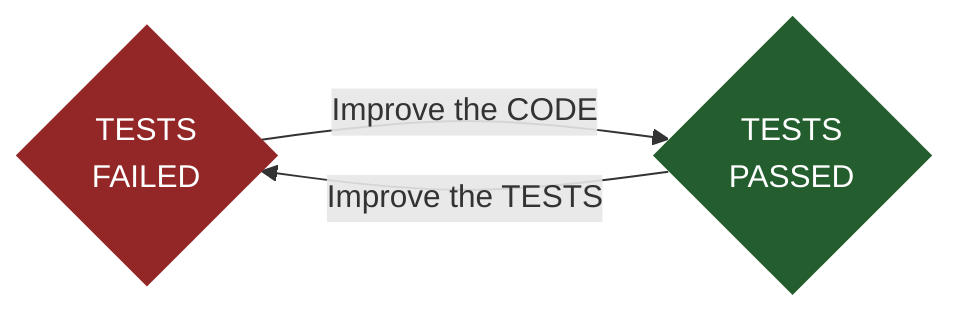

---
{"dg-publish":true,"permalink":"/savepoint-rs-video/","tags":["project/nb"],"noteIcon":"","updated":"2026-05-17T14:28:21.000+01:00","dg-note-properties":{"start":"2026-04-08","due":"2026-04-27","up":["[[Projects/No Boilerplate Index]]"],"tags":["project/nb"],"state":"done"}}
---

<!-- new_lines: 1 -->


_(graphics design is my passion)_
<!-- end_slide -->
<!-- skip_slide -->

Hi friends my name is Tris and this is No Boilerplate, where I focus on fast, technical videos.

I've made a little project for you that's ready to use today, but first, story time:

---

<!-- font_size: 2 -->
<!-- alignment: left -->
<!-- font_size: 3 -->
<span style="color: #88f">ME</span>

<!-- font_size: 2 -->
*Hey, could you help me? I don't understand what's wrong...*

*I've been staring at this code for an hour and at this point I just want to burn it all down!*
<!-- alignment: right -->
<!-- font_size: 3 -->
<span style="color: #f88">SENIOR</span>
<!-- font_size: 2 -->

*No problem!*

*First off, great instincts, delete your changes-*

<!-- end_slide -->
<!-- skip_slide -->

A few years ago, I was a mid-level developer working in a new team.
Like happens now and then when you are writing software, I had got myself tied up in a problem, and seemed to be going round in circles:
I couldn't figure out what was wrong.

SO I asked one of the senior developers for help.
She came over, and the conversation went something like this.

I started explaining what I had done that had led to this issue, but she politely but firmly didn't want to hear it.
What she wanted us to do was start over, revert to the last working commit and try again.

---

<!-- new_lines: 9 -->



<!-- end_slide -->
<!-- skip_slide -->

I was HORRIFIED - we would be wasteing hours of work, I thought!
But I was wrong, she was trying to save me from the sunk cost fallacy.

We stashed my changes and built it all up from scratch again.
I was astonished.
Not only did this NOT take the hours it had originally taken me to tie myself in knots, but we didn't even trip over the same bugs!
Something about the knowledge of what NOT to do that I had gained from my previous attempt, plus the clean-room approach to solving the issue again, worked surprisingly well!
When I asked her where she learned this horrible (but effective) technique, she said "TDD"; Test-Driven Development.

---

# TEST-DRIVEN DEVELOPMENT

<!-- new_lines: 6 -->



<!-- new_lines: 8 -->
<!-- alignment: right -->
For more info, watch my video:
["Compiler-Driven Development in Rust"](youtube.com/watch?v=Kdpfhj3VM04)

<!-- end_slide -->
<!-- skip_slide -->

In TDD, you build the tests and code iteratively and complementary to each other.
Improve the tests until they fail, then improve the code so the tests pass.
(I know the method usually has three parts, "Red Green Refactor", but I don't need to tell you to refactor for the same reason I don't need to tell you to breathe)

My senior colleague said that very often in her own work, she would make a commit at this point, a known-good state to fall back to, so she wouldn't have far to go if she tied HERSELF in knots and needed to revert to a previous state and try again.

At the time, I thought two things.
1. This sounded to me exactly like getting to a savepoint in a video game, and
2. I bet this process could be automated

I forgot all about these thoughts until today.

---

<!-- new_lines: 2 -->


<!-- new_lines: 3 -->
## PUBLIC DOMAIN VIDEOS

<!-- new_lines: 1 -->

> [!NOTE] &nbsp;Notes
> - For all links, read my scripts at www.namtao.com
> - All footnotes<sup>1</sup> are in the video description.

<!-- column_layout: [5,1] -->
<!-- column: 0 -->
<!-- column: 1 -->

<!-- new_lines: 0 -->


<!-- reset_layout -->

<!-- end_slide -->
<!-- skip_slide -->

I dedicate my video scripts to the public domain.

Everything you see here: script, links, and images are part of a Markdown document available freely on github and my website, namtao.com.

---


<!-- new_lines: 1 -->
 ---
<!-- new_lines: 2 -->
<!-- font_size: 2 -->

_github.com/NamtaoProductions/savepoint_

<!-- end_slide -->
<!-- skip_slide -->

SO, on that note: I've just published a tiny command-line tool called Savepoint. It's a command watcher that commits when you fix errors.
Here's a demo:

---

<!-- column_layout: [1,2,1] -->
<!-- column: 0 -->

<!-- new_lines: 5 -->
```html {1-10}
RUNS TESTS, WHICH PASS


GREAT! BREAK IT!
```
<!-- new_lines: 8 -->

```js {0}
TESTS PASS!


MAKES A SAVEPOINT COMMIT

WATCHES FOR CHANGES...
```

<!-- column: 1 -->
 ---

```shell {1-9}
$ savepoint -f js -- yarn test

🏁 SAVEPOINT: Running command...
    yarn test v0.15.1
    PASS ./login.test.js
    ✓ user can log in (5ms)
    ✨ Done in 0.17s.
🏁 SAVEPOINT: Monitoring..

🏁 SAVEPOINT: Running command...
    Summary of all failing tests
    FAIL login.test.ts (5ms)
    ● User Functions › login 
    Expected: "Test"
    Received: "Error"
🏁 SAVEPOINT: Error!
🏁 SAVEPOINT: Monitoring..

🏁 SAVEPOINT: Running command...
    yarn test v0.15.1
    PASS ./login.test.js
    ✓ user can log in (5ms)
    ✨ Done in 0.17s.
🏁 SAVEPOINT: Autosaving!
    [main 3d65083] SAVEPOINT REACHED!
     2 files changed, 16 insertions(+), 1 deletion(-)
🏁 SAVEPOINT: Monitoring..
```

<!-- column: 2 -->
<!-- new_lines: 13 -->

```js {0}
RERUNS TESTS, WHICH FAIL


GREAT! FIX IT!
```

<!-- reset_layout -->
<!-- end_slide -->
<!-- skip_slide -->

To use it, specify the filetype you want to watch for changes and the command to watch.
This would typically be your fastest unit test suite or if writing in a language like Rust, where if it compiles, it probably works, just your build command!

Savepoint executes the command on first run, which is good practice in TDD, so you know you're in a known-good state before you start coding.

In this example, our yarn tests have passed, and checkpoint is monitoring the code for changes, using no cpu and almost no ram while watching.

Let's improve our tests to make the code fail.

---
<!-- column_layout: [1,2,1] -->
<!-- column: 0 -->

<!-- new_lines: 5 -->
```html {0}
RUNS TESTS, WHICH PASS


GREAT! BREAK IT!
```
<!-- new_lines: 8 -->

```js {0}
TESTS PASS!


MAKES A SAVEPOINT COMMIT

WATCHES FOR CHANGES...
```

<!-- column: 1 -->
 ---

```shell {1,10-17}
$ savepoint -f js -- yarn test

🏁 SAVEPOINT: Running command...
    yarn test v0.15.1
    PASS ./login.test.js
    ✓ user can log in (5ms)
    ✨ Done in 0.17s.
🏁 SAVEPOINT: Monitoring..

🏁 SAVEPOINT: Running command...
    Summary of all failing tests
    FAIL login.test.ts (5ms)
    ● User Functions › login 
    Expected: "Test"
    Received: "Error"
🏁 SAVEPOINT: Error!
🏁 SAVEPOINT: Monitoring..

🏁 SAVEPOINT: Running command...
    yarn test v0.15.1
    PASS ./login.test.js
    ✓ user can log in (5ms)
    ✨ Done in 0.17s.
🏁 SAVEPOINT: Autosaving!
    [main 3d65083] SAVEPOINT REACHED!
     2 files changed, 16 insertions(+), 1 deletion(-)
🏁 SAVEPOINT: Monitoring..
```

<!-- column: 2 -->
<!-- new_lines: 13 -->

```js {1-10}
RERUNS TESTS, WHICH FAIL


GREAT! FIX IT!
```

<!-- reset_layout -->
<!-- end_slide -->
<!-- skip_slide -->

OK, great, savepoint picked up our changes, reran the test command, and it's failed as expected.
In TDD, when your tests fail, you improve your code to make them pass.

---
<!-- column_layout: [1,2,1] -->
<!-- column: 0 -->

<!-- new_lines: 5 -->
```html {0}
RUNS TESTS, WHICH PASS


GREAT! BREAK IT!
```
<!-- new_lines: 8 -->

```html {1-10}
TESTS PASS!


MAKES A SAVEPOINT COMMIT

WATCHES FOR CHANGES...
```

<!-- column: 1 -->
 ---

```shell {1,19-30}
$ savepoint -f js -- yarn test

🏁 SAVEPOINT: Running command...
    yarn test v0.15.1
    PASS ./login.test.js
    ✓ user can log in (5ms)
    ✨ Done in 0.17s.
🏁 SAVEPOINT: Monitoring..

🏁 SAVEPOINT: Running command...
    Summary of all failing tests
    FAIL login.test.ts (5ms)
    ● User Functions › login 
    Expected: "Test"
    Received: "Error"
🏁 SAVEPOINT: Error!
🏁 SAVEPOINT: Monitoring..

🏁 SAVEPOINT: Running command...
    yarn test v0.15.1
    PASS ./login.test.js
    ✓ user can log in (5ms)
    ✨ Done in 0.17s.
🏁 SAVEPOINT: Autosaving!
    [main 3d65083] SAVEPOINT REACHED!
     2 files changed, 16 insertions(+), 1 deletion(-)
🏁 SAVEPOINT: Monitoring..
```

<!-- column: 2 -->
<!-- new_lines: 13 -->

```js {0}
RERUNS TESTS, WHICH FAIL


GREAT! FIX IT!
```

<!-- reset_layout -->
<!-- end_slide -->
<!-- skip_slide -->

And when we do, savepoint picks up the changes, reruns the test command, which now passes.
Because we have transitioned from a failing state to a passing state, savepoint makes a git commit of this known good code.
Having done so, it returns to watching for further changes.

It does all this without user interaction, looping forever, ticktocking between failing and passing.

---

## SQUASH YOUR COMMITS BEFORE PUSHING
<!-- font_size: 2 -->
```sh {6-7}
...
SAVEPOINT: Autosaving!
    [main 3d65083] SAVEPOINT REACHED!
     2 files changed, 16 insertions(+), 1 deletion(-)

$ git reset --soft HEAD~3
$ git commit -m "FEAT: New user page"
```

<!-- font_size: 1 -->
(it's what heroes do)

<!-- end_slide -->
<!-- skip_slide -->

You run it once at the start of the day, and forget about it until it's time to squash your commits and push your changes.

Squashing related commits into an atomic change that can be better understood in a PR or selectively applied in a future debugging situation is good practice generally.
But as Savepoint will create multiple small commits as your tests pass, it is vital to clean those up into a single commit before you push.
It's possible that I, or a kind contributor, will automate this in Savepoint in the future.

Indeed, hopefully, there have already been many improvements and changes already implemented, suggested by my patrons, who see these videos before everyone else.

---
<!-- new_lines: 3 -->


 ---

- 📼 Early, longer, and more detailed videos
- 👨‍🏫 1:1 Mentoring over video chat
- ❤️ My infinite gratitude for allowing me to continue making these videos

<!-- end_slide -->
<!-- skip_slide -->

It's just me running this channel, and I'm so grateful to everyone for supporting me on this wild adventure.

If you'd like to see and give feedback on my videos up to a week early, as well as get private discord access, and even your name in the credits, it would be very kind of you to check my Patreon.

I'm also offering a limited number of mentoring slots. If you'd like 1:1 tuition on Obsidian, personal organisation, web programming, creative production, or anything that I talk about in my videos, do sign up and let's chat!

The core functionality of Savepoint is so simple, I was able to prototype it in a one-page script in Nushell:

---

 ---

```rust
#! /usr/bin/env nu 
let errfile = ".checkpoint.error"                              # Using a hidden file as a semophore

def main [...cmd: string] {                                    # Nu handles arg parsing in main's signature
  loop {
    clear
    let message = run-external $cmd | complete
    if ($message.exit_code) > 0 {                              # Test command exited with an error?
      print "ERROR!"
    } else {                                                   # Test command ran successfully?
      if (errfile exists) {                                    # We just fixed the previous error!
        let msg = $"CHECKPOINT: Errors fixed, autosaving."
        git commit -am $"($msg)"                               # Auto commit to git
        rm $errfile
      } else {                                                 # no error file? code must be working fine
        print "CHECKPOINT: Listening..."
      }
    }
    inotifywait -q . --include=rs -re modify                   # Wait until .rs files are written
  };
}
```

_(script edited for brevity to the point it no longer works)_

<!-- end_slide -->
<!-- skip_slide -->
Before rewriting in rust, I prototyped savepoint using nushell.

I write all my scripts in nu, which is a rust-like statically typed shell and language.
Whereas for my interactive terminal shell I still prefer fish, finally a shell for the 90s (now written in rust!), nushell is a delight to prototype quick scripts like this in.

---

<!-- new_lines: 6 -->

<!-- font_size: 7 -->
# `SIDEQUEST!`
<!-- font_size: 5 -->
# NUSHELL 🚀 SPEEDRUN

---

<!-- column_layout: [1,5,1] -->
<!-- column: 0 -->
<!-- column: 1 -->

# 1. STRUCTURED DATA

```rust
ls | where size > 6mb | sort-by modified
```

```nu +exec_replace +pty
sh -c "nu -c 'ls | where size > 6mb | sort-by modified'"
```

<!-- reset_layout -->

<!-- end_slide -->
<!-- skip_slide -->

...

---

## 2. BATTERIES INCLUDED

<!-- column_layout: [3,4,3] -->
<!-- column: 0 -->
<!-- column: 1 -->

```sql
http get https://httpbin.org/json
```

<!-- reset_layout -->
```nu +exec_replace +pty:100:20
sh -c "nu -m compact -c 'http get https://httpbin.org/json'"
```

<!-- end_slide -->
<!-- skip_slide -->

...


---
## 3. RUST-LIKE ERRORS

<!-- column_layout: [1,4,1] -->
<!-- column: 0 -->
<!-- column: 1 -->

```rust
10 / "tris"
```

```nu +exec_replace +pty
10 / "tris"
```

<!-- end_slide -->
<!-- skip_slide -->

...

---

 ---

```rust {1-20|2|4|7-9|10-13|15-16|19|1-20}
#! /usr/bin/env nu 
let errfile = ".checkpoint.error"                              # Using a hidden file as a semophore

def main [...cmd: string] {                                    # Nu handles arg parsing in main's signature
  loop {
    clear
    let message = run-external $cmd | complete
    if ($message.exit_code) > 0 {                              # Test command exited with an error?
      print "ERROR!"
    } else {                                                   # Test command ran successfully?
      if (errfile exists) {                                    # We just fixed the previous error!
        let msg = $"CHECKPOINT: Errors fixed, autosaving."
        git commit -am $"($msg)"                               # Auto commit to git
        rm $errfile
      } else {                                                 # no error file? code must still be working fine
        print "CHECKPOINT: Listening..."
      }
    }
    inotifywait -q . --include=js -re modify                   # Wait until .js files are written
  };
}
```

_(script edited for brevity to the point it no longer works)_

<!-- end_slide -->
<!-- skip_slide -->

OK, back to the nushell prototype.
As you can see, savepoint is doing nothing particulrlly clever:

...

The most important realisation I had when rewriting this into the final rust program you can download today, is that the logic is WAY simpler than these nested if statements suggest.

---
# THE SAVEPOINT STATE MACHINE

<!-- new_lines: 8 -->


<!-- end_slide -->
<!-- skip_slide -->

It's a state machine with two states, but only one important transition:
- If the test command passes after previously failing.

All other transitions are effectively no-ops:
- Passing tests when they already passed is a no-op
- Failing tests when they already were failing is a no-op
- Tests failing when they used to pass is a state change, but nothing happens yet.
- Only when tests pass after previously failing does something happen: We commit the changes.

I actually wrote the first rust version before figuring this out, I threw away most of that complex code after the realisation!

---

<!-- column_layout: [1,1] -->
<!-- column: 0 -->
## RUST STATE MACHINE
<!-- font_size: 2 -->

```rust {1-10|0}
enum State {
    Passing,
    Failing,
}
```

<!-- column: 1 -->
<!-- new_lines: 1 -->

```rust {0|1-10|4|0}
struct SavePoint {
    program: &str,
    args:    &[String],
    state:   State,
}
```

<!-- reset_layout -->

```rust {0|1-10|0}
impl SavePoint {
    fn test(mut self) -> Self {...}
    fn pass(self)     -> Self {...}
    fn fail(self)     -> Self {...}
}
```

<!-- font_size: 1 -->
_(Code edited for brevity to the point it no longer works)_

<!-- end_slide -->
<!-- skip_slide -->

I won't walk through the full code, you can imagine what the implementation looks like, and you can read it on github if you're really curious, but I want to highlight the clarity of structure here:

1. Firstly, it was natural to model the two states of this little state machine with Rust's enums.
2. Then, I attached the state to the SavePoint struct, which is the long-lived app object, including the test program and args supplied by the user, as well as a bunch of flags from the command line.
3. Finally, I implemented on the SavePoint struct the state transition methods pass and fail, themselves called by the test method depending on the exit code of the user's test command.

I'm glossing over a lot of UI and helper functions that don't really matter here of course.

---


<!-- new_lines: 1 -->
 ---

<!-- new_lines: 2 -->
<!-- font_size: 2 -->

_github.com/NamtaoProductions/savepoint_

<!-- end_slide -->
<!-- skip_slide -->

That's it! I hope this little utility becomes an invluable addition to your daily toolbox, and please report any issues you find or improvements you'd like to see.
If you're a rust developer, I would be delighted to review PRs, too.

And if you're not a rust developer, I can highly recommend the course by friend of the channel and sponsor of today's video: Let's Get Rusty.

---
<!-- font_size: 2 -->
<!-- new_lines: 3 -->


<!-- new_lines: 1 -->

`letsgetrusty.com/start-with-tris`

---
# THANK YOU

To all my patrons, you make this possible!

```rust
let sponsors = [
 "Jaycee"
];
let patrons: [&str; 1108];
```

I'd be very grateful for your support on:
- [Patreon](http://www.patreon.com/noboilerplate)
- [Ko-Fi](https://ko-fi.com/noboilerplate)
- [Gumroad](https://namtao.gumroad.com)

<!-- end_slide -->
<!-- skip_slide -->

If you would like to support my channel, get early ad-free and tracking-free videos, your name in the credits or 1:1 mentoring, head to my patreon or ko-fi.

If you're interested in transhumanism and hopepunk, please check out my weekly sci-fi audiofiction podcast, Lost Terminal.

I just finished Season 3 of The Phosphene Catalogue, if you like mysteries and art, check it out!

Transcripts and compile-checked markdown sourcecode are available on namtao.com and github, links in the description, and corrections are in the pinned ERRATA comment.

Thank you so much for watching, talk to you on Discord.

---

 