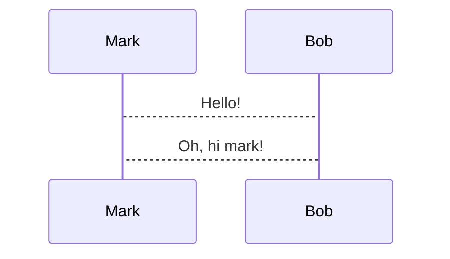

 
{"dg-publish":true,"permalink":"/presentest/","noteIcon":"","created":"2025-02-07T07:14:19.444+00:00","updated":"2025-02-07T08:01:16.274+00:00"}
 




Formulas
==

```latex +render
\[ \sum_{n=1}^{\infty} 2^{-n} = 1 \]
```

Layout example
==

<!-- column_layout: [2, 1] -->
<!-- column: 0 -->

## Rust

<!-- speaker_note: this is a rust speaker note -->

This is some code I like:

```rust
fn main () {
    println!("aok");
}
```

<!-- column: 1 -->

## TPC Pic


_Picture by X_

<!-- reset_layout -->

Because we just reset the layout, this text is now below both of the columns.

<!-- speaker_note: |
can use multiline
speakernotes like this
-->
