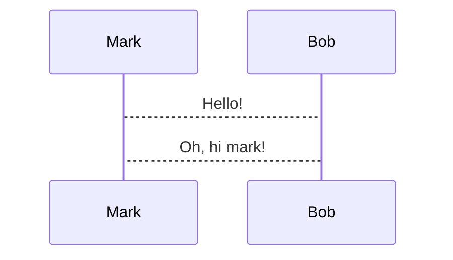

---
{"dg-publish":true,"permalink":"/presentest/","noteIcon":"","updated":"2025-02-11T06:51:50.000+00:00"}
---


# Good
- Can rewrite html comments into body text just the same as `note:`
## Bad
- Rust code is compiled, not run through clippy
- Text can't be centred reliably
- uses system mermaid, which can't render modern mermaid just yet

Mermaid
===



Formulas
===

```latex +render
\[ \sum_{n=1}^{\infty} 2^{-n} = 1 \]
```

Layout example
===

<!-- column_layout: [2, 1] -->
<!-- column: 0 -->

## Rust

<!-- speaker_note: this is a rust speaker note -->

This is some nice code I like:

```rust
fn main () {
    println!("aok");
}
```

<!-- column: 1 -->

## TPC Pic


_Picture by X_

<!-- reset_layout -->

Because we just reset the layout, this text is now below both of the columns

<!-- speaker_note: |
    can use multiline
    speakernotes like this
     
     
-->

## Tasks
 
 